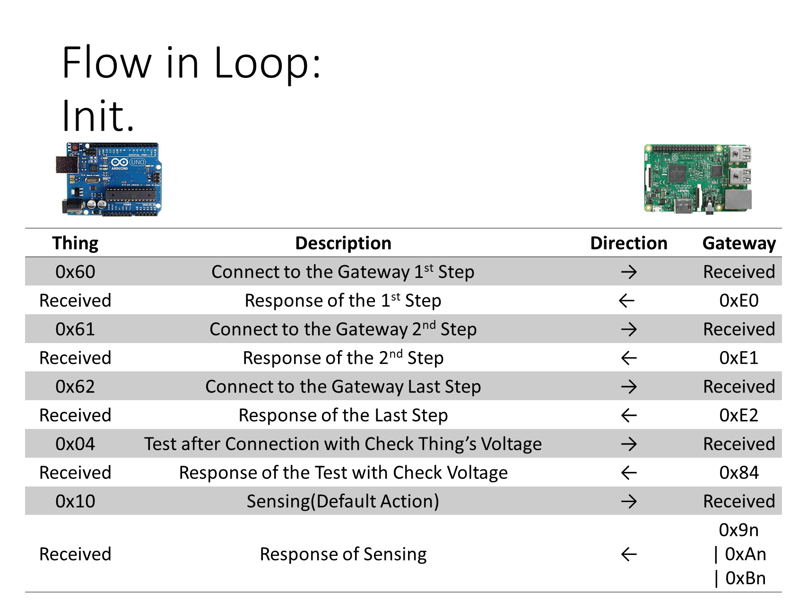
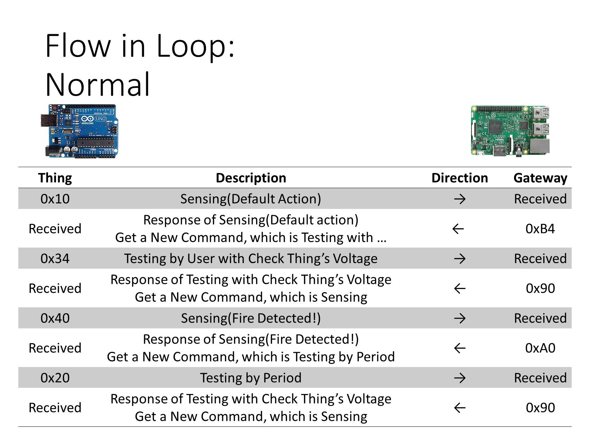
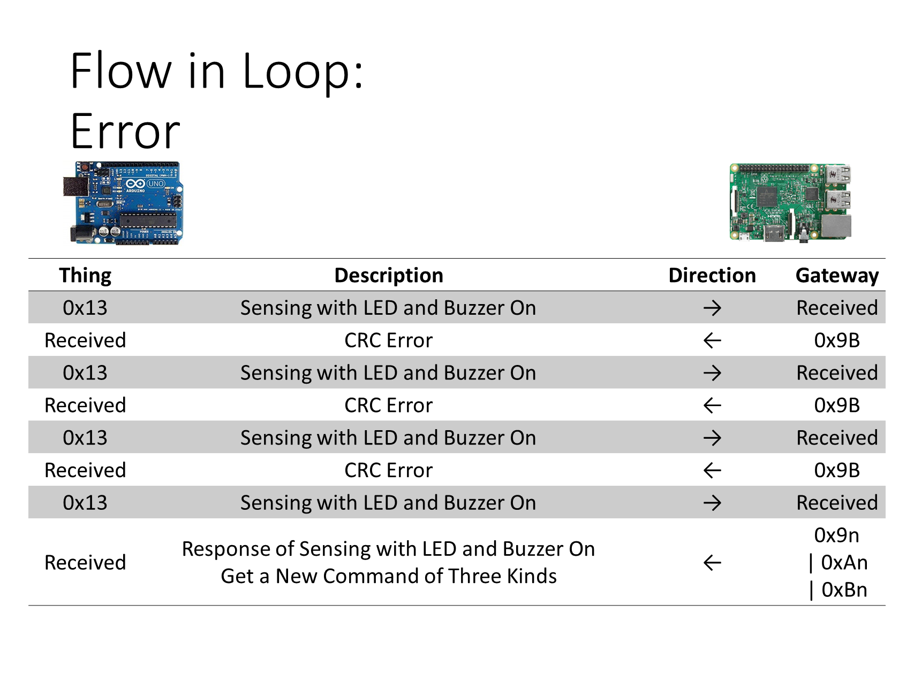

## 주요 기능<br>
1. 화재 감지<br>
2. 테스트 명령 수신 및 테스트 수행 결과 반환<br>
3. IoT 디바이스에 부착된 센서를 이용하여 주변 정보 수집 및 전송<br>

## 파트 별 내용 정리<br>
*   그동안 사물 상에 테스트 프로그램을 실행하여 얻은 테스트 결과들을 파트에 따라 정리한 내용임<br>
*   마지막 수정(Mar 9, 2020)<br>

####    General<br>
1. Pointer vs. Array<br>
*   개발 초창기에 포인터와 배열을 혼용해서 사용했으나, 성능과 일관성(Consistency)을 위해 배열식으로 통일하고자 한다.<br>
*   현재 Thing에서 사용하는 frame의 최대 길이는 9이며, 최대 길이를 대상으로 게이트웨이와 통신하였을 경우 문제 없음을 테스트를 통해 확인하였다.<br>
```C
/*
 *  Array: 
 *  movb    $0x00, 0x18(%esp)   
 */
    buf[2] = 0x00;  
/*
 *  Pointer: 
 *  mov     0x1c(%esp), %eax
 *  add     $0x2, %eax
 *  movb    $0x00, (%eax)
 */
    *(buf + 2) = 0x00;
```

2. Compiler<br>
*   아두이노에서 사용하는 컴파일러는 사용하지 않는 함수를 미리 확인하여 컴파일 시 무시한다.(pretty aggressive)<br>
```C
void setup()
{
    Serial.begin(9600);
}

void loop()
{
    func();
}

void func()
{
    Serial.println("Hello, world!");

    return;
}

```
```Text
...
Sketch uses 1492 bytes (4%) of program storage space. Maximum is 32256 bytes.
Global variables use 202 bytes (9%) of dynamic memory, leaving 1846 bytes for local variables.
...
```
```C
void setup()
{
    Serial.begin(9600);
}

void loop()
{
    /*  func(); */
}

void func()
{
    Serial.println("Hello, world!");

    return;
}


```
```Text
...
Sketch uses 1442 bytes (4%) of program storage space. Maximum is 32256 bytes.
Global variables use 184 bytes (8%) of dynamic memory, leaving 1864 bytes for local variables.
...
```
```C
void setup()
{
    Serial.begin(9600);
}

void loop()
{
    funcA();
    funcB();
}

void funcA()
{
#ifdef A
    Serial.println("Hello, world!");

    return;
#endif
}

void funcB()
{
    /*
    Serial.println("Hello, world!");

    return;
    */
}
```
```Text
...
Sketch uses 1442 bytes (4%) of program storage space. Maximum is 32256 bytes.
Global variables use 184 bytes (8%) of dynamic memory, leaving 1864 bytes for local variables.
...
```

*   또한 해당 컴파일러는 함수 내용을 inline으로 치환하므로, MACRO 선언과 function을 엄격하게 구분하여 사용할 필요는 없다. 가독성에 맞게 선택하여 사용하면 된다.<br>
```C
#define ENABLE_RF               \
do {                            \
    Serial.print((char) 0xAB);  \
    Serial.print((char) 0x03);  \
} while (0)

void setup()
{
    Serial.begin(9600);
}

void loop()
{
    ENABLE_RF;
}

```
```Text
Sketch uses 1458 bytes (4%) of program storage space. Maximum is 32256 bytes.
Global variables use 184 bytes (8%) of dynamic memory, leaving 1864 bytes for local variables.
```
```C
void setup()
{
    Serial.begin(9600);
}

void loop()
{
    funcC();
}

void funcC()
{
    Serial.print((char) 0xAB); 
    Serial.print((char) 0x03); 

    return;
}

```
```Text
Sketch uses 1458 bytes (4%) of program storage space. Maximum is 32256 bytes.
Global variables use 184 bytes (8%) of dynamic memory, leaving 1864 bytes for local variables.
```

####    RF Module<br>
1. Codes<br>
```C
/*  
*  Pre-processing to use the RF Module
*  Channel(Frequency) Setting -> Tx Power Level Setting -> Data Rate Setting
*  
*  [P_TX Data] Command
*  Header[1](0xAB) + OP Code[1](0x01) + Length[1](0x01 ~ 0x3F) + Data[1 ~ 63](Length)
*    ex) [TX]: 0xAB0103112233 -> [RX]: 0x03112233
*  
*  [Module OFF] Command
*  Header[1](0xAB) + OP Code[1](0x02)
*  
*  [Module ON] Command
*  Header[1](0xAB) + OP Code[1](0x03)
*  
*  [Channel(Frequency) Setting] Command
*  - EEPROM에 저장되므로 자주 변경 시 메모리 수명에 영향을 줌
*  Header[1](0xAB) + OP Code[1](0x04) + Channel Group[1] + Channel Number[1]
*    Group   : 0x00 ~ 0x03 까지 설정 가능, 0x01 이상부터 447MHz
*    Number  : 0x00 ~ 0x18 까지 25개의 채널 중 하나 선택 가능
*    ----------------------------------------------------------------
*    Ch No     Ch Gr = 0x00  Ch Gr = 0x01  Ch Gr = 0x02  Ch Gr = 0x03
*    1(0x00)   424.7000      447.2625      447.6000      447.8625
*    2(0x01)   424.7125      447.2750      447.6125      447.8750
*    3(0x02)   424.7250      447.2875      447.6250      447.8875
*    4(0x03    424.7375      447.3000      447.6375      447.9000
*    5(0x04)   424.7500      447.3125      447.6500      447.9125
*    6(0x05)   424.7625      447.3250      447.6625      447.9250
*    7(0x06)   424.7750      447.3375      447.6750      447.9375
*    8(0x07)   424.7875      447.3500      447.6875      447.9500
*    9(0x08)   424.8000      447.3625      447.7000      447.9625
*    10(0x09)  424.8125      447.3750      447.7125      447.9750
*    11(0x0A)  424.8250      447.3875      447.7250      447.9875
*    12(0x0B)  424.8375      447.4000      447.7375      -
*    13(0x0C)  424.8500      447.4125      447.7500      -
*    14(0x0D)  424.8625      447.4250      447.7625      -
*    15(0x0E)  424.8750      447.4375      447.7750      -
*    16(0x0F)  424.8875      447.4500      447.7875      -
*    17(0x10)  424.9000      447.4625      447.8000      -
*    18(0x11)  424.9125      447.4750      447.8125      -
*    19(0x12)  424.9250      447.4875      447.8250      -
*    20(0x13)  424.9375      447.5000      447.8375      -
*    21(0x14)  424.9500      447.5125      447.8500      -
*    22(0x15)  -             447.5250      -             -
*    23(0x16)  -             447.5375      -             -
*    24(0x17)  -             447.5500      -             -
*    25(0x18)  -             447.5625      -             -
*    ----------------------------------------------------------------
*    
*  [Tx Power Level Setting] Command
*  - EEPROM에 저장되므로 자주 변경 시 메모리 수명에 영향을 줌
*  Header[1](0xAB) + OP Code[1](0x05) + Power Level[1](0x00 ~ 0x0A, Default: 0x0A(10 dBm))
*  
*  [Data Rate Setting] Command
*  - EEPROM에 저장되므로 자주 변경 시 메모리 수명에 영향을 줌
*  Header[1](0xAB) + OP Code[1](0x06) + Data Rate[1](0x01 ~ 0x04, Default: 0x02)
*    0x01: 0.6kbps
*    0x02: 1.2kbps
*    0x03: 2.4kbps
*    0x04: 4.8kbps
*  
*  [RSSI Read] Command
*  Header[1](0xAB) + OP Code[1](0x07)
*    Response data:
*      0xAB0705:  -5 dBm
*      0xAB0750: -80 dBm
*      
*  [TX Test] Command
*  Header[1](0xAB) + OP Code[1](0x08) + Mode[1](0x01 ~ 0x03)
*    0x01: carrier test 시작
*    0x02: 2 kHz modulation 시작
*    0x03: test 종료 후 P_RX Mode로 전환
*    
*  [BER Test] Command
*  Header[1](0xAB) + OP Code[1](0x09)
*    Response data: 
*      0xAB090100수
*        BER 1,000개 중 1kHz 데이터 갯수
*        
*  
*  [Configureation Read] Command
*  Header[1](0xAB) + OP Code[1](0x0A)
*    Response data:
*      0xAB0A01020304
*        0x01: Group
*        0x02: Channel
*        0x03: Data Rate
*        0x04: TX Power Level
*        
*  [Version] Command
*  Header[1](0xAB) + OP Code[1](0x0B)
*    Response data:
*      0xAB0B53312E3030(단말기 버전, S1.00)
*/

/*  Enable RF   */
#define ENABLE_RF               \
do {                            \
    Serial.print((char) 0xAB);  \
    Serial.print((char) 0x03);  \
} while (0)

/*  Disable RF  */
#define DISABLE_RF              \
do {                            \
    Serial.print((char) 0xAB);  \
    Serial.print((char) 0x02);  \
    delay(1);                   \
} while (0)

/*  RF Module Configuration */
/*  
 *  각 설정이 적용되기까지 delay(1 << 7) 만큼의 시간이 있어야 함을 실험을 통해 확인하였음.
 *  자세한 내용은 아래에 기록해놓은 테스트 내용을 참고.
 */
for(i = 0; i < 4; i++) {
    Serial.print(CH_SET[i]);
}
delay(1 << 7);
for(i = 0; i < 3; i++) {                            
    Serial.print(TX_PWR[i]);
}
delay(1 << 7);
for(i = 0; i < 3; i++) {                            
    Serial.print(DATA_RATE[i]);
}
delay(1 << 7);

void sendAndRecv(void)
{
    int len, i;

/*
    char TX_DATA[]    = {0xAB, 0x01, 0x06, 0x82, 0x44, 0x28, 0x06, 0x04, 0x02};
    ENABLE_RF;
    for (i = 0; i < 9; ++i) {
        Serial.print(TX_DATA[i]);
    }
*/

    /*  0xAB | 0x01 | LEN | n(LEN)  */
    len = FRAME_START_OFFSET + 1 + tx[FRAME_START_OFFSET];
    ENABLE_RF;
    for (i = 0; i < len; ++i) {
        Serial.print(tx[i]);
    }
    DISABLE_RF;
    delay(DELAY_COMM);
    for (i = 0; Serial.available(); ++i) {
        rx[i] = Serial.read();
    }
    recvLen = i;

    return;
}
```

2. 주의사항<br>
*   RF Send와 Recv 사이에 delay() 함수를 사용해야 한다.<br>
*   RF Module Off 상태에서 0xAB|0x01|...(P_TX_DATA), 0xAB|0x02(Module Off), 그리고 0xAB|0x03(Module On) 명령을 만나면 RF Module On 상태로 바뀐다. <br>
*   테스트 수행 결과, RF Module Off 상태에서도 frame을 수신하는 것을 확인하였다. <br>

####    Frame<br>
1.  소개<br>
*   Frame으로 Thing을 제어할 수 있는 동작은 LED, BUZZER, CHECK_VOLTAGE, SENSING, TESTING 다섯 가지다.<br>
*   Format<br>
    *   0xAB | 0x01 | 0x06 | ID | CMD | VOLT | DATA1 | DATA2 | CRC<br>
*   LED<br>
    *   no bytes<br>
    *   0xAB | 0x01 | 0x06 | ID | LED | 0x00 | 0x00 | 0x00 | CRC<br>
*   BUZZER<br>
    *   no bytes<br>
    *   0xAB | 0x01 | 0x06 | ID | BUZZER | 0x00 | 0x00 | 0x00 | CRC<br>
*   LED<br>
    *   1 byte<br>
    *   0xAB | 0x01 | 0x06 | ID | CHECK_VOLTAGE | VOLT | 0x00 | 0x00 | CRC<br>
*   SENSING<br>
    *   1 byte<br>
    *   0xAB | 0x01 | 0x06 | ID | CMD | 0x00 | (0 | Average) | 0x00 | CRC<br>
*   TESTING<br>
    *   1 or 2 byte(s)<br>
    *   0xAB | 0x01 | 0x06 | ID | CMD | 0x00 | DATA1(NEAR) | DATA2(FAR) | CRC<br>
    *   0xAB | 0x01 | 0x06 | ID | CMD | 0x00 | DATA1(INCOMING) | 0x00 | CRC<br>
*   주요 Routine<br>
    *   Prepare<br>
    *   Connect to the Gateway<br>
    *   Check Thing's Voltage<br>
    *   Test after Connection<br>
    *   **Loop**<br>
    *   Finish<br>
*   Command<br>

|Command|Value(HEX)|
|------|---|
|Test After Connection|0x0n|
|Sensing(Default)|0x1n|
|Test by Period|0x2n|
|Test by User Request|0x3n|
|Fire Detected|0x4n|
|Connect|0x6n|
|Re-connect|0x70|

*   Action<br>
    *   Sort by 3-bit<br>

    |Action|Value(BIN)|
    |------|---|
    |Nothing|000|
    |Two LEDs|001|
    |BUZZER|010|
    |Two LEDs and BUZZER|011|
    |Check Voltage|100|
    |Check Voltage and Two LEDs|101|
    |Check Voltage and |BUZZER|110|
    |Check Voltage, Two LEDs and BUZZER|111|

    *   Example<br>
        *   0x17:   Sensing with Check Voltage, LED and Buzzer<br>
        *   0x05:   Testing after Connection with Check Voltage and LED<br>

*   Thing State<br>

|State|Description|
|------|---|
|Normal|기본 상태|
|Error|수신 받은 Frame의 CRC 검사를 통과하지 못함|
|Init.|Thing이 Main Routine을 실행하기 전 상태|

*   Flow<br>




2.  Codes<br>
```C
```

3.  주의 사항<br>
*   Sensing()과 Testing()은 동시에 일어나지 않으며, LED | BUZZER | CHECK_VOLT | TESTING 또는 LED | BUZZER | CHECK_VOLT | SENSING 둘 중 하나로 분기된다.<br>
*   화재 여부는 Sensing() 동작에서만 확인 가능하며, Testing() 중에서는 확인할 수 없다. <br>

####    Heat<br>
1. Codes<br>
```C
/*  Sensing(), Testing() 동작 확인을 위한 테스트 코드 및 결과   */
float getValue(uint8_t pin)
{
    int         i;
    float       temp;

    temp = 0;
    ENABLE_ADC;
    for (i = 0; i < 10; ++i) {
        temp += analogRead(pin);
    }
    DISABLE_ADC;

    return (temp / 10.0);
}

void heatingTest(void)
{
/*  #define SEC_8 33    */
    digitalWrite(HEATING, HIGH);
    Serial.println("HEATING ON");
    Serial.flush();
    Serial.println((getValue(TESTING_SENSOR)), DEC);
    Serial.flush();
    sleep(SEC_4);
    Serial.println((getValue(TESTING_SENSOR)), DEC);
    Serial.flush();
    sleep(SEC_4);
    Serial.println((getValue(TESTING_SENSOR)), DEC);
    Serial.flush();
    digitalWrite(HEATING, LOW);
    Serial.println("HEATING OFF");
    Serial.flush();
    Serial.println((getValue(TESTING_SENSOR)), DEC);
    Serial.flush();
    sleep(SEC_4);
    Serial.println((getValue(TESTING_SENSOR)), DEC);
    Serial.flush();
    sleep(SEC_8);
    Serial.println((getValue(TESTING_SENSOR)), DEC);
    Serial.flush();

    return;
}
```
```Text
...
HEATING ON
468.3999938964
475.6000061035
448.2000122070
HEATING OFF
446.6000061035
457.3999938964
419.3999938964
HEATING ON
469.6000061035
483.6000061035
477.2000122070
HEATING OFF
468.6000061035
457.6000061035
425.0000000000
HEATING ON
467.2000122070
474.3999938964
476.2000122070
HEATING OFF
466.6000061035
467.6000061035
413.3999938964
HEATING ON
472.2000122070
442.3999938964
475.6000061035
HEATING OFF
467.2000122070
465.6000061035
425.7999877929
...
```
```C
float getValue(uint8_t pin)
{
    int         i;
    float       temp;

    temp = 0;
    ENABLE_ADC;
    for (i = 0; i < 10; ++i) {
        temp += analogRead(pin);
    }
    DISABLE_ADC;

    return (temp / 10.0);
}

void prepareSensor(void)
{
    /*
     *  i           : 조건문에서 사용하는 제어 변수
     *  temp        : analogRead 결과를 임시 저장하는 변수
     *  filtered    : 센서로부터 얻은 값에 필터링을 거친 값
     */
    uint8_t     i;
    float       temp, filtered;

    pastValue   = INIT_SENSOR_TEMPERATURE;
    for (i = 0; i < PREPARE_TIME; ++i) {
        handleBuzzerAndLED(STATE_PREPARE);
        ENABLE_ADC;
        analogRead(ACTUAL_SENSOR);
        DISABLE_ADC;
        sleep(SEC_1);
    }

    return;
}

void sensing(void)
{
    /*
     *  func        : 디버깅 메세지를 작성하는 데 사용되는 식별 변수
     *  i           : 조건문에서 사용하는 제어 변수
     *  temp        : 임시 값 저장 변수
     *  filtered    : 센서로부터 얻은 값에 필터링을 거친 값
     *  tempStr     : 실수값에 대한 디버깅 메세지를 만들기 위한 버퍼
     */
    static char *func = "[void sensing(void)]";
    uint8_t     i;
    float       temp, filtered;
    char        tempStr[SIZE_BUF];

    /*  불이 났거나, 감지를 해야할 시기일 경우  */
#ifdef TEST_SENSOR
    reserve = RESERVE_TIME;
#endif
    if (isWarning || (reserve == RESERVE_TIME)) {
        temp = getValue(ACTUAL_SENSOR);
        /*  노이즈 제거부 */
        data[index++] = (filtered = (HEAT_ALPHA * CURVE(temp)) + (HEAT_BETA * pastValue));
        if (index == SIZE_DATA) {
            handleBuzzerAndLED(STATE_FULLED_BUFFER);
            index   = 0;
            temp    = (float) 0.0;
            for (i = 0; i < SIZE_DATA; ++i) {
                temp += data[i];
            }
            /*  Frame에서의 데이터는 1 byte여야 함  */
            averageValue    = (uint8_t) (temp / (float) SIZE_DATA);
            thingState      = SEND_A_AVERAGE_DATA;
        }
        heatThreshold   = (countFireDetected) ? (THRESHOLD - 1) : THRESHOLD;
        if (filtered > heatThreshold) {
            (countFireDetected >= LAPSE) ? (isWarning = true) : ++countFireDetected;
        } else {
            if (countFireDetected) {
                --countFireDetected;
            }
        }
        dtostrf(filtered, 4, 2, tempStr);
        sprintf(tempDbg, "Index: %u, filtered value: %s degree, count of fire detection: %u", index, tempStr, countFireDetected);
        putsForDebug(__SENSOR__, func, tempDbg);
        if (isWarning) {
            if (countFireDetected) {
                /*  화재일 경우 thingState에는 화재 정보를 최우선으로 담아야 함 */
                thingState = NOTIFY_FIRE_DETECTED;  
                handleBuzzerAndLED(STATE_FIRE);
                RELAY_ON;
                sprintf(tempDbg, "%x", MSG_FIRE);
                putsForDebug(__SENSOR__, func, tempDbg);
            } else {
                isWarning   = false;
                RELAY_OFF;
            }
        }
        pastValue   = filtered;
        reserve     = 0;
    } else {
        ++reserve;
    }

    return;
}

void testing(void)
{
    /*
     *  func        : 디버깅 메세지를 작성하는 데 사용되는 식별 변수
     *  i           : 조건문에서 사용하는 제어 변수
     *  testValue1  : 테스트 센서로부터 얻은 값, Heating 전
     *  testValue2  : 테스트 센서로부터 얻은 값, 1차 Heating 직후
     *  testValue3  : 테스트 센서로부터 얻은 값, 2차 Heating 직후
     *  value       : 주 감지 센서로부터 얻은 값
     *  tempStr1    : 실수값에 대한 디버깅 메세지를 만들기 위한 버퍼1
     *  tempStr2    : 실수값에 대한 디버깅 메세지를 만들기 위한 버퍼2
     */
    static char *func = "[void testing(void)]";
    uint8_t     i;
    float       testValue1, testValue2, testValue3, value;
    char        tempStr1[SIZE_BUF];
    char        tempStr2[SIZE_BUF];

    handleBuzzerAndLED(STATE_RECEIVED_TEST);
    testResult  = 0; 
    testValue1      = CURVE(getValue(TESTING_SENSOR));
    value           = CURVE(getValue(ACTUAL_SENSOR));
    currTestValue   = (uint8_t) testValue1;
    currValue       = (uint8_t) value;
    dtostrf(testValue1, 4, 2, tempStr1);
    dtostrf(value, 4, 2, tempStr2);
    /*  2도 이상 차이가 나면 에러 */
    if (ABS((testValue1 - value)) > TEST_NORMAL_THRESHOLD) { 
        testResult      |= HEAT_ERROR;
        sprintf(tempDbg, "Test 1 failed. Heating value: %s, value: %s", tempStr1, tempStr2);
        putsForDebug(__SENSOR__, func, tempDbg);
        handleBuzzerAndLED(STATE_TESTING_FAILED);

        return;
    }
    sprintf(tempDbg, "Test 1 passed. Heating value: %s, value: %s", tempStr1, tempStr2);
    putsForDebug(__SENSOR__, func, tempDbg);
    /*  sleep 1 second, to stabilize the thing   */
    sleep(SEC_1);   
    ++testResult;
    if (testValue1 < TEST_HEATING_THRESHOLD) {
        digitalWrite(HEATING, HIGH);
        sleep(SEC_4);
        testValue2      = CURVE(getValue(TESTING_SENSOR));
        sleep(SEC_4);
        testValue3      = CURVE(getValue(TESTING_SENSOR));
        value           = CURVE(getValue(ACTUAL_SENSOR));
        digitalWrite(HEATING, LOW);
        currTestValue   = (uint8_t) testValue3;
        currValue       = (uint8_t) value;
        dtostrf(testValue3, 4, 2, tempStr1);
        dtostrf(value, 4, 2, tempStr2);
        /*  Cooling after heating   */
        sleep(SEC_60);
        if ((ABS((testValue2 - testValue1)) < TEST_HEATING_DIFF) 
            || (ABS((testValue3 - testValue2)) < TEST_HEATING_DIFF) 
            || (ABS((testValue3 - value)) < TEST_HEATING_DIFF)) {
            testResult      |= HEAT_ERROR;
            sprintf(tempDbg, "Test 2 failed. Heating value: %s, value: %s", tempStr1, tempStr2);
            putsForDebug(__SENSOR__, func, tempDbg);
            handleBuzzerAndLED(STATE_TESTING_FAILED);
            
            return;
        }
    } else {
        sprintf(tempDbg, "Sensor overheating. Heating value: %s, value: %s", tempStr1, tempStr2);
        putsForDebug(__SENSOR__, func, tempDbg);
    }
    /*  testResult 값을 0으로 만들어 성공했음을 알림    */
    --testResult;
    sprintf(tempDbg, "Test 2 passed. Heating value: %s, value: %s", tempStr1, tempStr2);
    putsForDebug(__SENSOR__, func, tempDbg);
    handleBuzzerAndLED(STATE_TESTING_PASSED);

    return;
}
```

2. 주의사항<br>
*   Mar 9, 2020 기준 센서 동작 결과가 일관성이 없다. 값을 읽을 때 노이즈를 최대한 줄이기 위해 10개 값에 대한 평균 값을 사용함에도 불구하고 값이 일정하지 못하고, 값이 증가해야 할 부분에서 종종 추세를 거스르는 값이 나오곤 한다. 이러한 현상은 앞으로 테스트를 통해 수정해야 한다.<br>
*   Mar 9, 2020, 센서에 부착된 배터리의 전압이 낮아질수록 일관성 문제가 빈번하게 발생한다. 배터리를 Power Supply로 교체하니 일관성 문제는 어느 정도 해결이 된 걸로 보인다.<br>
*   analogRead() 값을 10개 수집하여 그에 대한 평균값을 사용하고 있는데, 여전히 Noise 값이 발생한다.<br>
```Text
...
[util.ino][void checkBattery(void)]Voltage: 6.39 V
[sensor.ino][void sensing(void)]Index: 1, filtered value: 25.92 degree, count of fire detection: 0
[sensor.ino][void sensing(void)]Index: 2, filtered value: 27.23 degree, count of fire detection: 0
[sensor.ino][void sensing(void)]Index: 3, filtered value: 22.10 degree, count of fire detection: 0
[sensor.ino][void sensing(void)]Index: 4, filtered value: 26.09 degree, count of fire detection: 0
[sensor.ino][void sensing(void)]Index: 5, filtered value: 26.24 degree, count of fire detection: 0
[sensor.ino][void testing(void)]Test 1 failed. Heating value: 24.45, value: 32.22
[util.ino][void checkBattery(void)]Voltage: 6.39 V
[sensor.ino][void sensing(void)]Index: 6, filtered value: 25.65 degree, count of fire detection: 0
[sensor.ino][void sensing(void)]Index: 7, filtered value: 27.15 degree, count of fire detection: 0
[sensor.ino][void sensing(void)]Index: 8, filtered value: 26.56 degree, count of fire detection: 0
[sensor.ino][void sensing(void)]Index: 9, filtered value: 27.43 degree, count of fire detection: 0
[sensor.ino][void sensing(void)]Index: 10, filtered value: 27.69 degree, count of fire detection: 0
[sensor.ino][void testing(void)]Test 1 failed. Heating value: 24.39, value: 27.80
[util.ino][void checkBattery(void)]Voltage: 6.39 V
[sensor.ino][void sensing(void)]Index: 11, filtered value: 26.96 degree, count of fire detection: 0
[sensor.ino][void sensing(void)]Index: 12, filtered value: 27.55 degree, count of fire detection: 0
[sensor.ino][void sensing(void)]Index: 13, filtered value: 26.68 degree, count of fire detection: 0
[sensor.ino][void sensing(void)]Index: 14, filtered value: 27.46 degree, count of fire detection: 0
[sensor.ino][void sensing(void)]Index: 15, filtered value: 27.70 degree, count of fire detection: 0
[sensor.ino][void testing(void)]Test 1 failed. Heating value: 24.63, value: 29.49
[util.ino][void checkBattery(void)]Voltage: 6.39 V
[sensor.ino][void sensing(void)]Index: 16, filtered value: 26.96 degree, count of fire detection: 0
[sensor.ino][void sensing(void)]Index: 17, filtered value: 27.55 degree, count of fire detection: 0
[sensor.ino][void sensing(void)]Index: 18, filtered value: 27.72 degree, count of fire detection: 0
[sensor.ino][void sensing(void)]Index: 19, filtered value: 27.78 degree, count of fire detection: 0
[sensor.ino][void sensing(void)]Index: 20, filtered value: 26.75 degree, count of fire detection: 0
[sensor.ino][void testing(void)]Test 1 passed. Heating value: 24.19, value: 23.51
[sensor.ino][void testing(void)]Test 2 failed. Heating value: 27.97, value: 27.80
[util.ino][void checkBattery(void)]Voltage: 6.37 V
[sensor.ino][void sensing(void)]Index: 21, filtered value: 26.70 degree, count of fire detection: 0
[sensor.ino][void sensing(void)]Index: 22, filtered value: 27.47 degree, count of fire detection: 0
[sensor.ino][void sensing(void)]Index: 23, filtered value: 27.70 degree, count of fire detection: 0
[sensor.ino][void sensing(void)]Index: 24, filtered value: 27.77 degree, count of fire detection: 0
[sensor.ino][void sensing(void)]Index: 25, filtered value: 26.75 degree, count of fire detection: 0
[sensor.ino][void testing(void)]Test 1 failed. Heating value: 27.80, value: 31.94
[util.ino][void checkBattery(void)]Voltage: 6.39 V
[sensor.ino][void sensing(void)]Index: 26, filtered value: 26.70 degree, count of fire detection: 0
[sensor.ino][void sensing(void)]Index: 27, filtered value: 27.47 degree, count of fire detection: 0
[sensor.ino][void sensing(void)]Index: 28, filtered value: 27.70 degree, count of fire detection: 0
[sensor.ino][void sensing(void)]Index: 29, filtered value: 25.66 degree, count of fire detection: 0
[sensor.ino][void sensing(void)]Index: 0, filtered value: 26.12 degree, count of fire detection: 0
[sensor.ino][void testing(void)]Test 1 passed. Heating value: 25.26, value: 26.69
[sensor.ino][void testing(void)]Test 2 failed. Heating value: 27.97, value: 29.90
...
```

####    Smoke<br>
1. 업데이트 예정<br>

####    ADC<br>
1. Codes<br>
```C
#define ENABLE_ADC          \
do {                        \
    ADCSRA  |= (1 << ADEN); \
    delay(1);               \
} while (0)                 \

#define DISABLE_ADC         \
do {                        \
    ADCSRA  = 0;            \
} while (0)                 \
```

2. 주의사항<br>
*   ENABLE_ADC 상태에서 analogRead() 함수를 사용해 값을 읽으면, 매 시간 값이 변하는 것을 확인할 수 있으나, DISABLE_ADC 상태에서 analogRead() 함수를 사용해 값을 읽으면, 마지막으로 analogRead() 함수를 사용해 얻어온 값으로 고정 반환된다.<br>
*   ENABLE_ADC, DISABLE_ADC는 sleep() 함수와 연속되게 사용해도 잘 동작함을 실험을 통해 확인하였다.<br>

####    Interrupt<br>
1. 업데이트 예정<br>

####    Utilities<br>
1. Codes<br>
```C
/*  SETUP WATCHDOG TIMER
 *  ---------------------------------------------------------
 *  WDTCSR = (24);      : change enable and WDE - also resets
 *  WDTCSR = (6);       : prescalers only - get rid of the WDE and WDCE bit
 *  WDF | WDIE | WDP3 | WDCE | WDE | WDP2 | WDP1 | WDP0
 *      WDP3 - WDP2 - WPD1 - WDP0 - time
 *      0      0      0      0      16 ms
 *      0      0      0      1      32 ms
 *      0      0      1      0      64 ms
 *      0      0      1      1      0.125 s
 *      0      1      0      0      0.25 s
 *      0      1      0      1      0.5 s
 *      0      1      1      0      1.0 s
 *      0      1      1      1      2.0 s
 *      1      0      0      0      4.0 s
 *      1      0      0      1      8.0 s
 *      
 *  WDTCSR |= (1<<6);  : enable interrupt mode
 */

/*  ENABLE SLEEP - this enables the sleep mode  */
#define ENABLE_SLEEP                            \
do {                                            \
    SMCR |= (1 << 2);   /*  power down mode */  \
    SMCR |= 1;          /*  enable sleep  */    \
} while (0)

void enableSleep(void)
{
    /*  clear interrupts    */
    cli();
    /*  enable sleep    */
    ENABLE_SLEEP;
    /*  set interrupts  */
    sei();

    return;
}

void sleep(int i)
{
/*  #define SEC_60          (-1);   */
    if (i == SEC_60) {
        /*  change enable and WDE - also resets */
        WDTCSR  = (24);
        /*  prescalers only - get rid of the WDE and WDCE bit */
        WDTCSR  = (33);      
        /*  enable watchdog timer   */
        ENABLE_WATCHDOG;    
        /*  8 sec * 7 times    */
        SLEEP;
        SLEEP;
        SLEEP;
        SLEEP;
        SLEEP;
        SLEEP;
        SLEEP;
    } else {
        /*  change enable and WDE - also resets */
        WDTCSR  = (24);
        /*  prescalers only - get rid of the WDE and WDCE bit */
        WDTCSR  = (i);      
        /*  enable watchdog timer   */
        ENABLE_WATCHDOG;    
        SLEEP;
    }

    return;
}

void putsForDebug(const char *file, const char *func, const char *msg)
{
/*  실제 코드에서는, RELEASE 버전일 때 아래 부분을 무시해야 하므로 이러한 전처리기를 사용함 */
#ifndef ALALALA
    DISABLE_RF;
    Serial.print('\n');
    Serial.print('\r');
    Serial.print(file);
    Serial.print(func);
    Serial.println(msg);
    Serial.flush();
    delay(32);
#endif

    return;
}

/*
 *  3-bit
 *  --------+-----------+------------
 *  2       |   1       |   0
 *  --------+-----------+------------
 *  Buzzer  |   Red LED |   Green LED
 *  --------+-----------+------------
 *  B: On   |   R: On   |   G: On
 *  X: Off  |   X: Off  |   X: Off
 *  --------+-----------+------------
 */
#define STATE_NORMAL            00    
#define STATE_PREPARE           01
#define STATE_XXG               01
#define STATE_FULLED_BUFFER     02
#define STATE_XRX               02
#define STATE_CHECK_BATTERY     03
#define STATE_XRG               03
#define STATE_RECEIVED_TEST     04
#define STATE_BXX               04
#define STATE_TESTING_PASSED    05
#define STATE_BXG               05
#define STATE_TESTING_FAILED    06
#define STATE_BRX               06
#define STATE_FIRE              07
#define STATE_BRG               07

void handleBuzzerAndLED(uint8_t op)
{
    digitalWrite(STATUS1, (op & 01) ? HIGH : LOW);
    op >>= 1;
    digitalWrite(STATUS0, (op & 01) ? HIGH : LOW);
    op >>= 1;
    digitalWrite(BUZZER, (op & 01) ? HIGH : LOW);
    sleep(MILSEC_125);
    digitalWrite(STATUS1, LOW);
    digitalWrite(STATUS0, LOW);
    digitalWrite(BUZZER, LOW);

    return;
}
```

2. 주의사항 <br>
*   putsForDebug() 함수 사용 시 Thing 내부의 Serial 포트에 영향을 주는가에 대한 정보가 부재한 상태였기에, 해당 정보를 확보하기 위한 테스트를 수행하였다. 테스트 수행 결과 putsForDebug() 함수가 Thing 내부 Serial 포트에 영향을 주는 것을 확인했으며, 이러한 문제를 해결하기 위해 putsForDebug() 함수 내부에 DISABLE_RF 매크로를 삽입하여 상기 문제를 해결하였다. <br>
*   MCU가 sleep 모드에 진입할 경우, 각 port를 그대로 holding한 채로 sleep 모드에 진입하는 것을 실험을 통해 확인하였다.<br>
*   sleep 상태로 진입한 후에 watchdog에 의해 MCU가 깨어났을 때, sleep 명령의 바로 다음 줄로 분기된다. sleep() 함수 내부에 여러 번 SLEEP 매크로를 사용해 sleep 시간을 늘릴 수도 있다.<br>
*   sleep 상태로 진입하면 각 포트는 기존 상태를 그대로 가져가고, 메모리 상에 있는 변수들도 그대로 유지된다.<br>
*   Mar 9, 2020, Power Supply로 운용하면 기대했던 바와 다른 동작을 보여준다. 원인을 발견할 때까지 3V 건전지 직렬 연결한 상태로 Thing을 운용한다. 인터넷에 검색해본 결과, 과전류 문제인 것 같다.<br>
*   전압이 이상하게 나오는 문제는, 게이트웨이로 프레임을 보내보고 어떠한 값이 수신되는가 확인해봐야 한다.<br>

####    기타<br>
*   기판에서의 통신 먹통 현상은 기판의 문제일수도, RF Module의 접촉 불량 문제일수도, 또는 다른 문제일수도 있다.<br>
*   putsForDebug() 함수 내부에 delay(32) 시간을 삽입하여 운용한 결과 통신 먹통 현상이 어느 정도 해결되었다(Mar 6, 2020). 최종 출시 단계에서 putsForDebug() 함수는 삭제될 함수이므로, putsForDebug() 함수 내부에 delay()를 넣어 운용한다고 해도 크게 문제되지 않을 듯 하다.<br>
