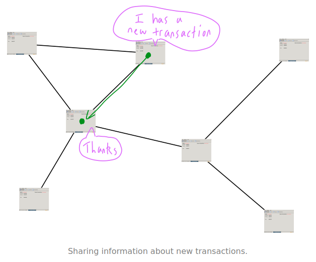
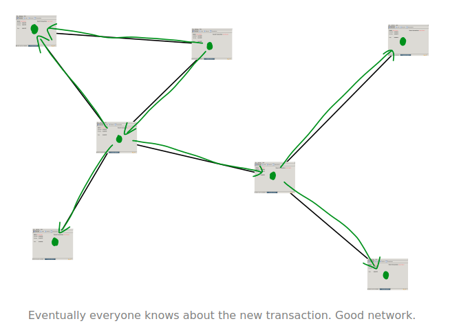
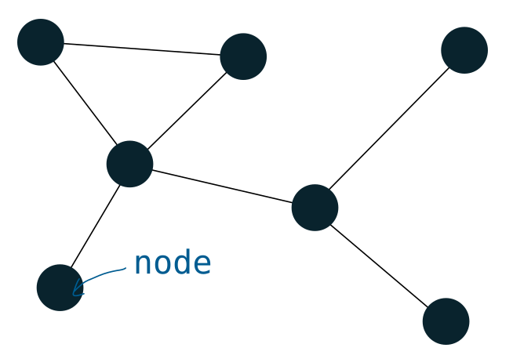
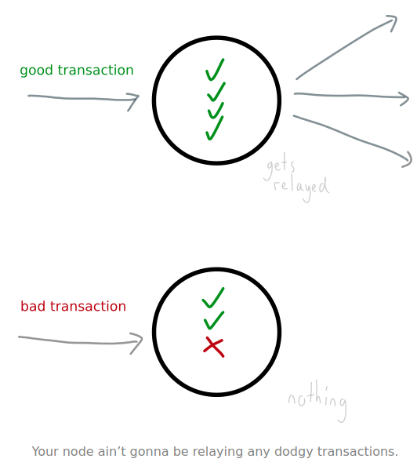
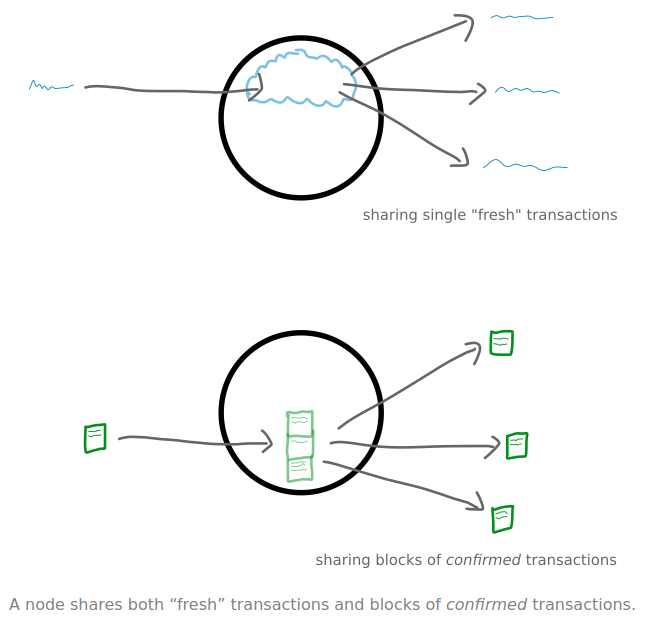
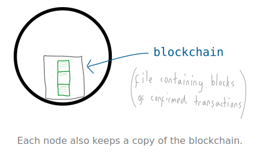
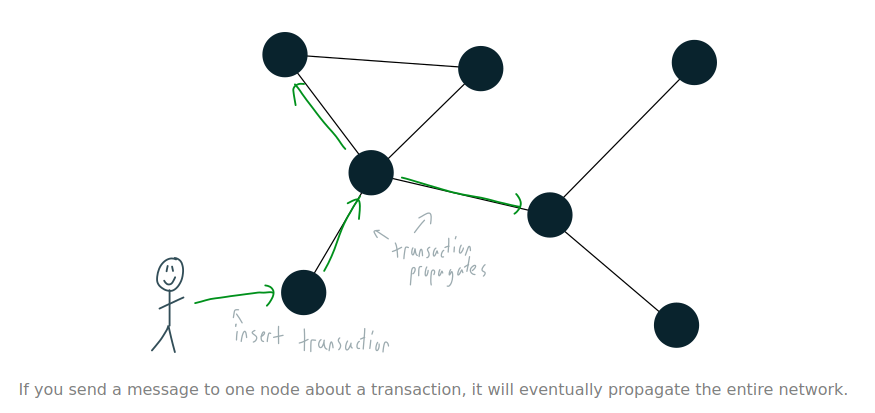

#   Bitcoin Network 
###  The network of computers running the bitcoin program. 

####    What is the Bitcoin Network? 
*   The Bitcoin Network is made up of everyone running the bitcoin software (better known as “bitcoin clients”). 

####    What does the network do? 
*   People (well, bitcoin clients) on the network talk to each other. 
*   And by “talk to each other” I mean pass on information about what’s going on in other parts of the network. 
This is done by sending each other messages. 
For example, a message could be information about a new transaction. 

*   This sharing of information (e.g. transactions) is what allows the everyone on the network to keep up-to-date, which is pretty important if you want to run a digital currency on the Internet. 

>   The Bitcoin Network is described as a [peer-to-peer network](https://en.wikipedia.org/wiki/Peer-to-peer), because: 
1. Everyone is connected to each other, so it’s a network. 
2. Everyone on the network is equal, so we are peers. 

####    Who makes up the network? 
*   As mentioned, anyone with an active Internet connection and running a [bitcoin client](https://bitcoin.org/en/download). 
Seriously, anyone can join the bitcoin network. 
All you need is an internet connection and a bitcoin client, which is a piece of software like any other. 
And once you’re up and running you’ll be referred to as a node on the bitcoin network. 

##  Nodes 
### Computers running the bitcoin program. 

####    What is a node? 

*   A node is just a computer that is running the Bitcoin program. More importantly, it is connected to other computers (running the same program) to create a [Network](#bitcoin-network). 

####    What does a node do? 
*   A node has three jobs: 
    1.  Follow rules 
    2.  Share information 
    3.  Keep a copy of confirmed transactions 

1.  Follow rules 
*   Each node (bitcoin client) has been programmed to follow a set of rules. 
By following these rules a node is able to check the transactions it receives and only relay them if everything is cool. 
If there are any problems, the transaction isn’t passed on. 

*   For example, one rule is that a person must own an equal or greater amount of bitcoins than they are trying to send. 
So if your node receives a transaction where someone has tried to send more bitcoins than they own, the transaction won’t be passed on to other nodes. 

2.  Share information 
*   A node’s main job is to share information with other nodes, and the quintessential information a node shares is transactions. 
Now, there are two types of transactions that nodes share: 
    1.  Fresh transactions – transactions that have recently entered the network. 
    2.  Confirmed transactions – transactions that have been “confirmed” and written to a file. These are shared in blocks of transactions, and not individually. 

3.  Keep a copy of confirmed transactions 
*   As mentioned, each node also keeps blocks of confirmed transactions. These are held together in a file called the [blockchain](../2_mining/README.md#the-blockchain). 

*   Fresh transactions are bounced around the network until they are etched into the blockchain, which is a ledger of confirmed transactions. 
Each node has a copy of the blockchain for safe keeping, and shares it with other nodes if their copy isn’t up to date. 

*   The process of adding fresh transactions to the blockchain is called [Mining](../2_mining). 

>   I wasn’t to mention that each node is autonomous. 
By that I mean that when you run a bitcoin client, the network doesn’t “tell you what to do”. 
Instead, your bitcoin client already knows what to do, and it makes it’s own decisions. 
So the entire bitcoin network is made up of nodes making their own decisions, but they each make the same decisions as one another, which makes it a completely decentralised yet powerful network. 
>>  If every other node went offline, your node would be upholding the entire bitcoin network. 

####    Do I have to be a node to use bitcoin? 
*   **No.** 
You can send and receive bitcoins without having to be a node. You just need to get the transaction into the bitcoin network and you’re good to go. 

*   If you’re using a web wallet for example, they will feed the transactions you make into the network for you. 
