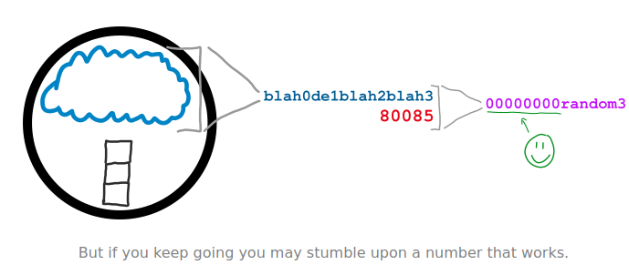
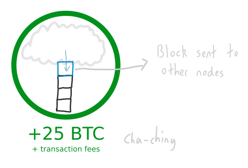

#   Mining 
##  The process of adding blocks to the blockchain. 

### What is Mining? 
*   Mining is the process of adding blocks(transactions) to the blockchain. 

### How does it work? 
*   Every node on the bitcoin network shares information about new transactions. 
They store these transactions in their memory pool. 

*   Each node also has the option to try and “mine” the transactions in their memory pool in to a file. 
This file is a ledger of every bitcoin transaction, and it’s called the **blockchain**. 

>   However, to add transactions from the memory pool to the blockchain, a node has to use a lot of computer processing power. 

*   This processing power is forced through the existence of a **challenge** in the memory pool. 

### What is this challenge? 
*   Imagine you’re a node. At any moment in time you can condense the transactions in your memory pool in to a single “string” of numbers and letters. 

*   Now, your objective is to hash this string with another number to try and get a new string that begins with a certain number of zeros. 

*   Now, this sounds easy enough, but it’s actually difficult. 
It’s utterly random, and you can only hope to find a winning result through trial and error. 
And that’s what Mining is – lots of hashing (using lots of your computer’s processing power) and hoping to get lucky. 

*   But if you are lucky enough to find a successful hash result, the transactions in your memory pool get added to the blockchain, and every other node on the network adds your block of transactions to their blockchain. 

*   You’ll also receive a 25BTC reward for your effort, as well as picking up any fees that were tacked on to the transactions that you just added to the blockchain. 

>   The “certain number of zeros” comes from the difficulty. 
This is set by the network and changes based on the volume of miners – the more people mining, the greater the difficulty and the more zeros are needed at the start (which makes it harder to find a winning result). 

### Why is Mining necessary? 
>   Because mining allows the entire Bitcoin Network to agree on which transactions get “archived”, and this is how you prevent fraud in a digital currency. 

*   When you make a bitcoin transaction, nodes on the network do not hear about it instantly. 
Instead, transactions travel across the bitcoin network by being passed from one node to the next. 

*   However, it’s actually possible to make another transaction using those same bitcoins and insert that transaction in to the network too. 
For example, you could buy a beer with some bitcoins, then quickly attempt to buy a slice of pizza with those same bitcoins too. 

*   In other words, some good ol’ **fraud**.

*   Yet even though you make the pizza transaction after the beer transaction, due to the way transactions travel across the Bitcoin Network, the network would be in a disagreement about whether you should get the beer or the pizza.

### So how does the network decide which transaction to go with? 
>   If a node on the network completes the challenge, then it’s the transactions in their memory pool that get added to the blockchain. 

*   It seems like a little unorthodox way to select transactions, I know, but this is the solution the bitcoin network uses to reach a consensus when dealing with conflicting information. 
>   On the plus side, it only takes about 10 minutes for each new block of transactions to be added to the blockchain, so you only need to wait 10 minutes for a confirmation that bitcoins have “arrived” at a new address (and haven’t been sent to an alternative address). 

### Another benefit of Mining. 
>   If you want to try and control the blocks (i.e. transactions) that get added to the blockchain, you have to compete to solve block puzzles with every other mining node on the bitcoin network. 
*   In other words, you need to have a computer with enough processing power that is able to out-work the combined processing power of every other bitcoin miner. 

*   Which is entirely possible – you just need to spend a few billion on hardware and you’re good to go (although this figure increases with every new miner who joins the network). 

##  The Blockchain 
### A shared file of bitcoin transactions. 

##  Blocks 
### Collections of bitcoin transactions. 

##  Difficulty 
### A mechanism for regulating the time it takes to mine a block. 
