#   Transactions 
##  Selecting batches of bitcoins and creating new ones from them. 

### What is a bitcoin transaction? 
>   A bitcoin transaction is a bunch of data. 
*   This data contains information about the amount being sent, the account it is being sent from, and the account it is being sent to. 
This is basic information, so it can be easily represented in a single line of data: 

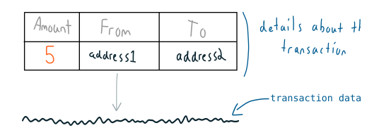

*   And when you “make a transaction”, you just send this transaction data in to the bitcoin network. 

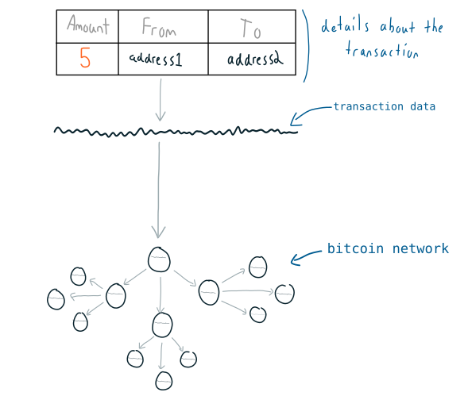

*   Eventually one of the nodes on the network will mine your transaction in to a block, and this block (with your transaction in it) will be added to the file of confirmed transactions (the blockchain). 
And that’s all a bitcoin transaction is – feeding a simple line of data in to the bitcoin network and waiting for it to be mined in to the blockchain. 

### How does a bitcoin transaction work? 
*   A bitcoin address is like an account number that holds bitcoins. 
But when you make a transaction, it’s not like taking an exact amount of coins out of a pot and moving them in to another. 
Instead, an address keeps track of each individual transaction it has received: 

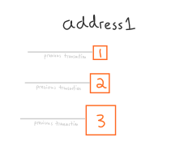

*   So when you want to send bitcoins to someone else, you grab whole amounts that you have already received, and use them to send a new amount to a new address: 

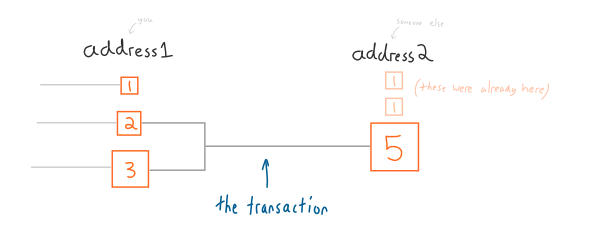

*   And when that someone else wants to send bitcoins to another person, they will use up the whole amounts they have received in the same way: 

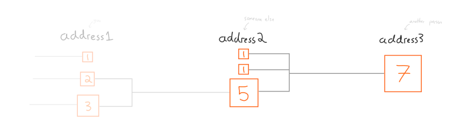

*   So in effect you receive bitcoins in batches, and you use those batches to create new batches to send to other people. 
That’s how transactions work. 

### Hang on a minute… 
>   “What if the total of the batches adds up to more than I want to send?” 
*   Good question sir. 
In this instance (which it often is), you just add another output to the transaction and send the difference back to yourself: 

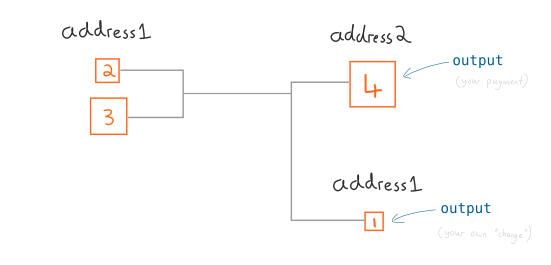

*   This may seem awkward at first, I know, but it’s a **precise way of doing it from a programming perspective**, so get used to it. 

### Summary: 
1.  You have a bitcoin address. Bitcoins arrive at this address in batches, called outputs. 
2.  A bitcoin transaction is the process of using these outputs (as inputs in the transaction) to create new outputs that belong to someone else’s address. 
3.  All of this can be represented by a single line of data. 

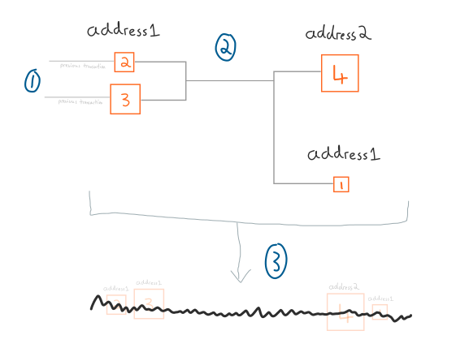

### What prevents someone else from spending my bitcoins? 
*   Or in other words… 
“If making a transaction is simply a case of feeding a line of data in to the bitcoin network, why can’t someone construct a transaction that includes my address and uses it to send bitcoins to their address?” 
**Answer**: Because each of the transaction outputs has a lock… 

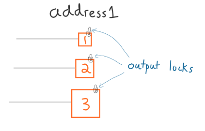

*   And if you create a transaction without first unlocking these outputs, nodes on the bitcoin network will reject the transaction. 

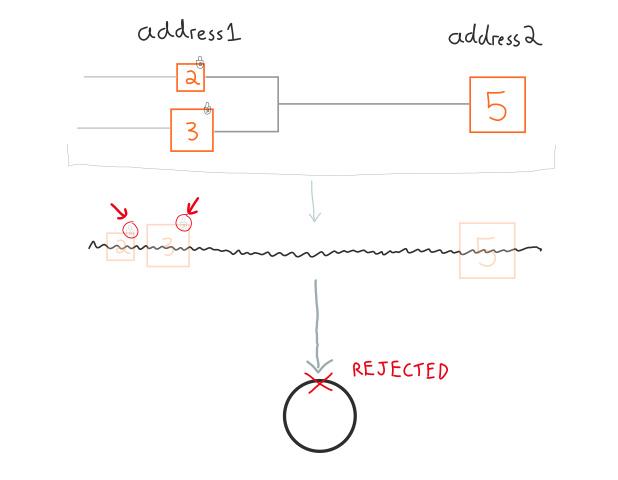

*   But fortunately for you, your bitcoin address comes with a private key. 

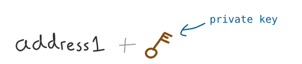

*   So if you want to send bitcoins somewhere, you use this private key to unlock the outputs located at your address. 

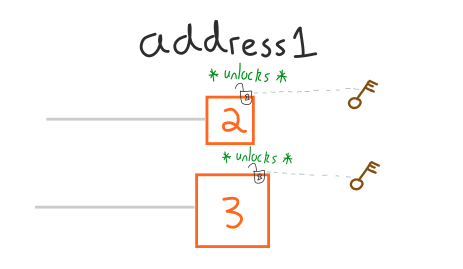

*   After unlocking all of the outputs you want to use, the transaction will be accepted and propagated by nodes on the bitcoin network. 

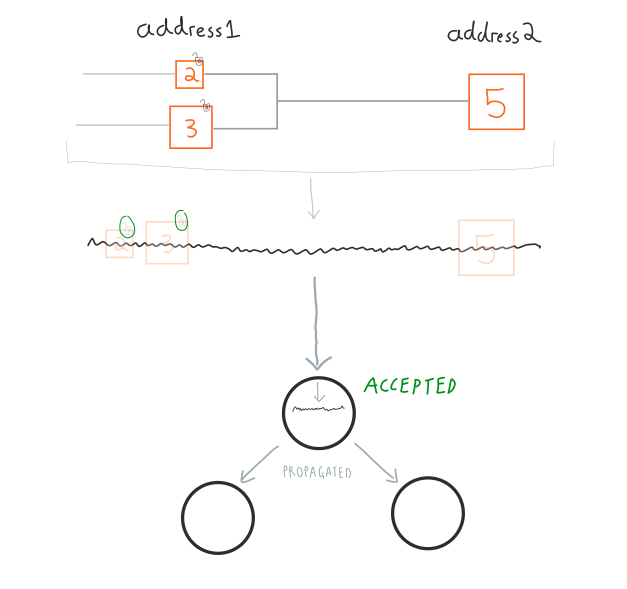

*   And that’s how bitcoin transactions work. 

##  Outputs 
### The new batches of bitcoins created in transactions. 

##  Output Locks 
### Locking mechanisms for batches of bitcoins. 

