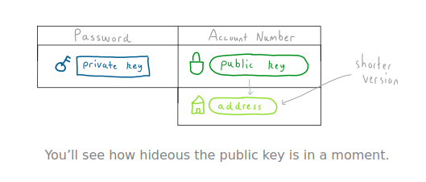
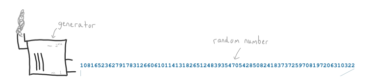
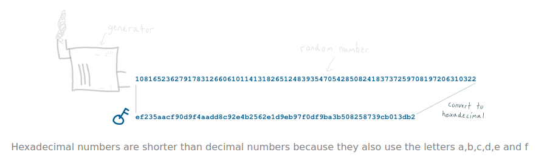
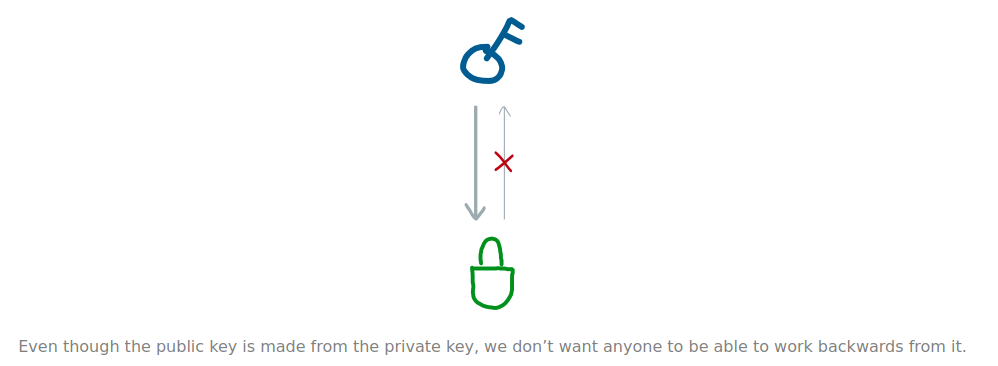
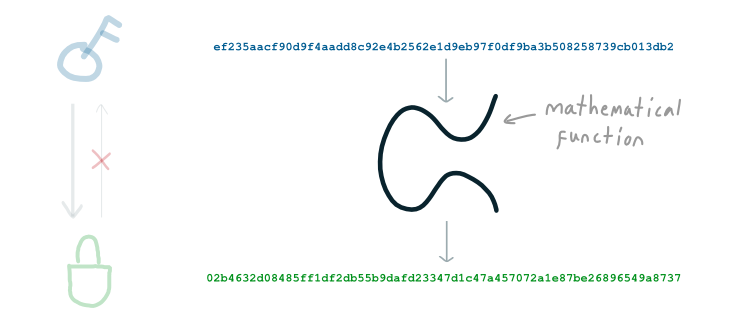
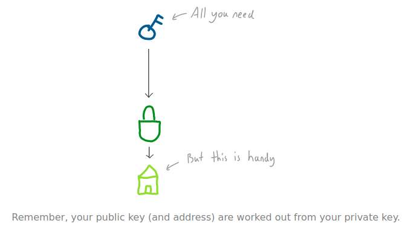
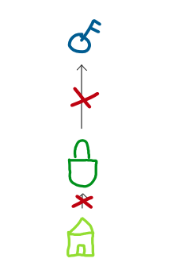

#   Keys & Addresses 
##  Unique numbers used for sending and receiving batches of bitcoins. 

### What is a private key, a public key, and an address? 
*   To send and receive money in bitcoin you need an “account number” and a “password”. 
In bitcoin we call these a public key(account number) and a private key(password). 
However, this “account number” is awkwardly long number. 
So to make life easier we create a condensed version of this public key, and we call it our address. 

*   And that’s the role of the private key, the public key, and the address. 
>   Your public key is your account number. 
Your address is your account number too, but it’s a shorter version that people use when sending you bitcoins. 
Your private key is the password that prevents other people from sending bitcoins from your address. 

### Where do keys and addresses come from? 
####    Private Key 
*   It all starts with the private key, which is just a randomly generated number: 

*   But because this number is so large, computers (and bitcoin) like to work with it in hexadecimal format: 

*   And there we have a private key… just a big random number (in hexadecimal format). 

>   A private key can be any number between 1 and 115792089237316195423570985008687907852837564279074904382605163141518161494337. 

####    Public Key 
*   You use your private key to create your public key. 
But first of all, this public is going to be seen by other people. Therefore, when we use the private key to create our public key, we don’t want it to be possible for anyone to figure out what our private key was. 
Because after all, the private key protects our bitcoins. 

*   Fortunately we can use a special type of mathematical function to achieve this. 
We just shove the private key in to it (which is a number after all), and the function spits out a public key (a new number). 

*   Now, there are two benefits of using this particular function: 
    1.  This function returns a public key that is mathematically connected to our private key. 
    This will come in handy when we want to send bitcoins in a transaction.
    2.  Even though the public key is connected to the private key, it’s not possible to figure out what the private key is from the public key. 
    And this is why we use this particular mathematical function… because it’s a “one-way” function. 

*   And ta-da, thanks to our random number and this function, we now have a pair of keys that we can use to send and receive money in bitcoin. 

####    Address 
*   Oh yeah, that public key is hideous isn’t it. 
Nobody is going to enjoy typing that out, so let’s make it more practical and call it an address. 
All we’ve done here is compress the public key, and used a format that doesn’t make use of any characters that look similar to each other when written down (i.e. no “0”, “O”, “o” or “l”). 
So no, it still doesn’t quite roll off the tongue, but it is an improvement. 
And that’s all an address is – a shorter/easier version of the public key. 

| Field | Value |
|-------|-------|
| Private Key | ef235aacf90d9f4aadd8c92e4b2562e1d9eb97f0df9ba3b508258739cb013db2 |
| Public Key | 02b4632d08485ff1df2db55b9dafd23347d1c47a457072a1e87be26896549a8737 |
| Address | 1EUXSxuUVy2PC5enGXR1a3yxbEjNWMHuem |

>   Due to the way the public key has been compressed, it’s not possible to work out the public key from the address. 

### Do I have to remember all 3 of these keys? 
*   Because your public key and address are worked out from your private key, you can get away with just saving your private key. 

### What happens if I lose my private key? 
*   Well then you’re **fully** out of luck. 
It’s impossible to work out your private key from either your public key or address, so if you lose your private key, **it’s lost**. 

##  Private Keys 
### Randomly generated big numbers. 

##  Public Keys 
### A unique number generated from your private key. 

##  Digital Signatures 
### A number created from your private key to prove you own its public key. 

##  Signing & Verifying 
### Proving that a signature and public key were created by the same private key. 

