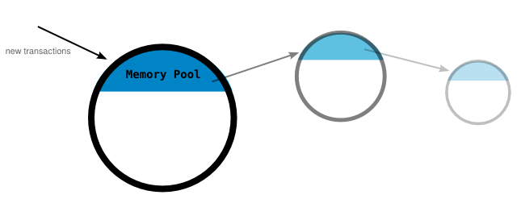
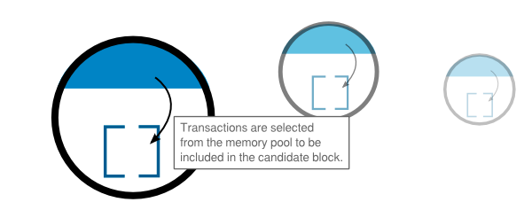

#   Node 

##  Memory Pool 
### Temporary storage for transactions that have been received by a node. 

*   When a new transaction is received by a node, it will hold it in its memory pool with all the other latest transactions it has received. 
From here the transaction will be hoping to get selected for inclusion in the candidate block.

*   So basically, the memory pool is a waiting room for new transactions. 

##  Candidate Block 
### A block of transactions from the memory pool. 

