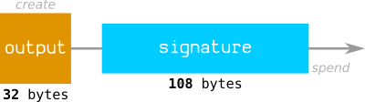
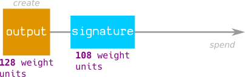

#   Transaction<br>

##  TXID<br>
### The hash of a transaction’s data.<br>

##  Transaction Data<br>

##  Input<br>
### A batch of bitcoins being used up in a bitcoin transaction.<br>

##  Output<br>
### A batch of bitcoins being created in a bitcoin transaction.<br>

##  scriptPubKey<br>
### The locking mechanism placed on an output.<br>

##  Locktime<br>
### Field in a transaction used for post-dating.<br>

##  Fees<br>

##  Weight<br>
### A metric for measuring the “size” of a transaction.<br>


With the introduction of [BIP 141](https://github.com/bitcoin/bips/blob/master/bip-0141.mediawiki#transaction-size-calculations) [(Segregated Witness)](../../3_advanced/segwit), transactions were given a new unit of measurement called weight.<br>
This weight measurement basically gives the validation part of a transaction (the signature data) a discount, so it doesn’t take up as much “space” inside a block.<br>
In other words, the signature data is less costly than the rest of the transaction data.

### Calculation<br>
The weight of a transaction is calculated by multiplying the size (in bytes) of different parts of the [transaction data](#transaction-data) by different values:<br>

| Data | Multiplier |
|------|------------|
| Version | x4 |
| **Marker** | **x1** |
| **Flag** | **x1** |
| Input Count | x4 |
| Input | x4 |
| Output Count | x4 |
| Output | x4 |
| **Witness** | **x1** |
| Locktime | x4 |

### Example<br>
Transaction: [c586389e5e4b3acb9d6c8be1c19ae8ab2795397633176f5a6442a261bbdefc3a](https://learnmeabitcoin.com/explorer/transaction/c586389e5e4b3acb9d6c8be1c19ae8ab2795397633176f5a6442a261bbdefc3a)

```Text
02000000
00
01
0140d43a99926d43eb0e619bf0b3d83b4a31f60c176beecfb9d35bf45e54d0f742
01000000
17
160014a4b4ca48de0b3fffc15404a1acdc8dbaae226955
ffffffff
01
00e1f50500000000
17
a9144a1154d50b03292b3024370901711946cb7cccc387
024830450221008604ef8f6d8afa892dee0f31259b6ce02dd70c545cfcfed8148179971876c54a022076d771d6e91bed212783c9b06e0de600fab2d518fad6f15a2b191d7fbd262a3e0121039d25ab79f41f75ceaf882411fd41fa670a4c672c23ffaf0e361a969cde0692e8
00000000
```

| Data | Bytes | Multiplier | Weight |
|------|------|------|------|
| Non-Witness | 106 | x4 | 434 |
| Witness | 110 | x1 | 110 |

Total weight: 534<br>

### Why x4?<br>
> The factor of 4 helps to create more of a balance between the the cost of creating an output and the cost of spending an output.<br>

In typical transaction data, an output can be created using around 32 bytes, but spending it requires around 108 bytes:<br>



> With the old metric, every byte of data you included in a transaction increased its fee. So as a result, it cost more to spend an output than it did to create one.<br>

However, by using the new weight metric, there is more of an even balance between the cost of creating an output and spending an output:



> With the weight metric, spending an output “costs” roughly the same as creating one.<br>

As a result, this creates a more balanced incentive to spend outputs, which should help to reduce the size of the UTXO set (which takes up valuable space in RAM on a computer running a full node).<br>
### References<br>
* [https://segwit.org/why-a-discount-factor-of-4-why-not-2-or-8-bbcebe91721e](https://segwit.org/why-a-discount-factor-of-4-why-not-2-or-8-bbcebe91721e)

##  UTXO<br>
### An unspent transaction output.<br>

