# MSOL_BitcoinParser<br>
A parser that analysis json script of bitcoin<br>

## 개발환경<br>
### OS 정보<br>
```Text
$ lsb_release -a
No LSB modules are available.
Distributor ID:	Ubuntu
Description:	Ubuntu 18.04.3 LTS
Release:	18.04
Codename:	bionic
```

### gcc 정보<br>
```Text
$ gcc -v
Using built-in specs.
COLLECT_GCC=gcc
COLLECT_LTO_WRAPPER=/usr/lib/gcc/x86_64-linux-gnu/7/lto-wrapper
OFFLOAD_TARGET_NAMES=nvptx-none
OFFLOAD_TARGET_DEFAULT=1
Target: x86_64-linux-gnu
Configured with: ../src/configure -v --with-pkgversion='Ubuntu 7.4.0-1ubuntu1~18.04.1' --with-bugurl=file:///usr/share/doc/gcc-7/README.Bugs --enable-languages=c,ada,c++,go,brig,d,fortran,objc,obj-c++ --prefix=/usr --with-gcc-major-version-only --program-suffix=-7 --program-prefix=x86_64-linux-gnu- --enable-shared --enable-linker-build-id --libexecdir=/usr/lib --without-included-gettext --enable-threads=posix --libdir=/usr/lib --enable-nls --with-sysroot=/ --enable-clocale=gnu --enable-libstdcxx-debug --enable-libstdcxx-time=yes --with-default-libstdcxx-abi=new --enable-gnu-unique-object --disable-vtable-verify --enable-libmpx --enable-plugin --enable-default-pie --with-system-zlib --with-target-system-zlib --enable-objc-gc=auto --enable-multiarch --disable-werror --with-arch-32=i686 --with-abi=m64 --with-multilib-list=m32,m64,mx32 --enable-multilib --with-tune=generic --enable-offload-targets=nvptx-none --without-cuda-driver --enable-checking=release --build=x86_64-linux-gnu --host=x86_64-linux-gnu --target=x86_64-linux-gnu
Thread model: posix
gcc version 7.4.0 (Ubuntu 7.4.0-1ubuntu1~18.04.1) 
```

### curl 설치<br>
```Text
$ apt-get install libcurl4-openssl-dev
```

### Compile<br>
```Bash
$ gcc -o run test.c -lcurl
```

## DB<br>
```Bash
MySQL Client Version: 5.7.28
```
> "MySQL clients must be linked using the -lmysqlclient -lz options in the link command. You may also need to specify a -L option to tell the linker where to find the library.<br>

## Running Time<br>
```Bash
#1. Only parsing
[main.c][main(int, char *[])]                   : Index: 0
[main.c][main(int, char *[])]                   : Index: 1

...

[main.c][main(int, char *[])]                   : Index: 607476
[util.c][calcRunningTime(size_t)]               : Running time: 07:21:48
```

## Concepts<br>
### [Beginner’s Guide](./1_beginners)<br>
* An introduction to bitcoin.<br>

### [Technical Guide](./2_technical)<br>
* An explanation of each part of bitcoin.<br>

## [About blk.dat](https://learnmeabitcoin.com/guide/blkdat)<br>
### What is blk.dat<br>
* The files that contain mined bitcoin transactions.<br>
* The blk.dat files in ~/.bitcoin/blocks/ contain raw block data received by a bitcoin core node. <br>
These blk.dat files basically store “the blockchain”.<br>

#### Example<br>
```Text
f9beb4d9
1d010000
0100000000000000000000000000000000000000000000000000000000000000000000003ba3edfd7a7b12b27ac72c3e67768f617fc81bc3888a51323a9fb8aa4b1e5e4a29ab5f49ffff001d1dac2b7c 
01
01000000010000000000000000000000000000000000000000000000000000000000000000ffffffff4d04ffff001d0104455468652054696d65732030332f4a616e2f32303039204368616e63656c6c6f72206f6e206272696e6b206f66207365636f6e64206261696c6f757420666f722062616e6b73ffffffff0100f2052a01000000434104678afdb0fe5548271967f1a67130b7105cd6a828e03909a67962e0ea1f61deb649f6bc3f4cef38c4f35504e51ec112de5c384df7ba0b8d578a4c702b6bf11d5fac00000000
```

#### Structure<br>
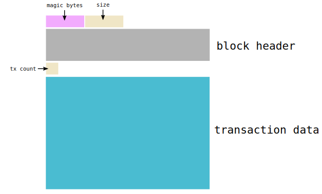<br>
* The *[magic bytes](#magic-bytes)* and *size* allow you to figure out where the data for each block starts and ends.<br>
* The *[block header](#block-header)*.<br>
* The *[tx count(variable integer)](#variable-ingeter)*, followed by the *transaction data* for each one.<br><br><br>
  
#### Data<br>
```Text
[ magic bytes ][    size     ][        block header        ][  tx count  ][          transaction data          ]
 <- 4 bytes ->  <- 4 bytes ->  <-        80 bytes        ->  <- varint ->  <-            remainder           ->
```
> The size field is what allowed me to figure out that I needed to read 293 bytes to get the whole block.<br>
The size is given as 1d010000, so get this in human format:<br><br>1. Swap the endianness to get 0000011d<br>2. Convert to hexadecimal to get 285<br><br>So in addition to the initial 8 bytes for the magic-bytes + size, I know the size of the upcoming block data is going to be 285 bytes.<br>


#### Notes<br>
* Blocks are not downloaded in order.<br>
> This is because your bitcoin node will download blocks in parallel to download the blockchain as quickly as possible. Your node will download blocks further ahead of the current one as it goes, instead of waiting to receive each block in order.<br>
The maximum distance ahead your node will fetch from (or the “maximum out-of-orderness”) is controlled by [BLOCK_DOWNLOAD_WINDOW](https://github.com/bitcoin/bitcoin/search?q=BLOCK_DOWNLOAD_WINDOW) in the bitcoin source code.<br>

* The maximum blk.dat file size is 128MiB (134,217,728 bytes)<br>
```C
// src/wallet/test/wallet_tests.cpp lines at 40
GetBlockFileInfo(oldTip->GetBlockPos().nFile)->nSize = MAX_BLOCKFILE_SIZE;
```
```C
// src/validation.h lines at 72
static const unsigned int MAX_BLOCKFILE_SIZE = 0x8000000; // 128 MiB
```
```C
// src/validation.cpp lines at 3191
while (vinfoBlockFile[nFile].nSize + nAddSize >= MAX_BLOCKFILE_SIZE) {
 nFile++;
 if (vinfoBlockFile.size() <= nFile) {
  ...
 }
}
```

## Appendix
### Magic Bytes<br>
#### The message delimeter on the bitcoin network.<br>
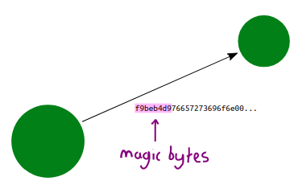<br>
* Magic bytes are used as a way to identify the separate messages sent between [nodes](https://learnmeabitcoin.com/beginners/nodes) on the [bitcoin network.](https://learnmeabitcoin.com/beginners/network)<br>
For example, if you are trying to connect to a node with your own code, every message you send to that node should begin with *f9beb4d9*, and every message you receive from that node will start with the **same magic bytes** too.<br>

#### The Magic Bytes<br>
* Magic bytes are 4 bytes in length, and will be different depending on which network you’re on<br>

| Network	| Magic Bytes |
|---------|-------------|
| Mainnet	| f9beb4d9 |
| Testnet3	| 0b110907 |
| Regtest	| fabfb5da |

#### Why use Magic Bytes?<br>
* If you are trying to read this data, it’s good to have a reliable way of knowing when a new message starts (and ends). This is why a specific set of “magic bytes” are used as a “marker” so that you can always identify the start of a new message.<br>
So there’s nothing actually magical about magic bytes – it’s just a way of segmenting data.<br>

### Block Header<br>
#### A summary of the data in the block.<br>
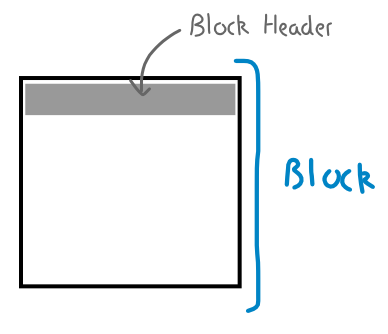<br>
* A block header is like the metadata at the top of a block of transactions.<br>

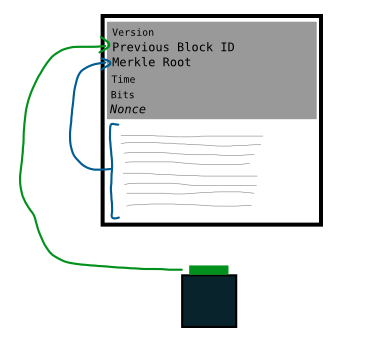<br>
* The fields in the block header provide a unique summary of the entire block.<br>

| Field	| Size	| Data | Description |
|-------|------|------|-------------|
| Version	| 4 bytes	| Little-endian | The version of the block. |
| Previous Block Hash	| 32 bytes	| Big-endian | The [Block Hash](https://learnmeabitcoin.com/guide/block-hash) of the block that this block is being built on top of. This is what “chains” the blocks together. |
| [Merkle Root](https://learnmeabitcoin.com/guide/merkle-root)	| 32 bytes	| Big-endian | 	All of the transactions in this block, hashed together. Basically provides a single-line summary of all the transactions in this block. |
| Time	| 4 bytes	| Little-endian | 	When a miner is trying to mine this block, the Unix time at which this block header is being hashed is noted within the block header itself. |
| [Bits](https://learnmeabitcoin.com/guide/bits)	| 4 bytes	| Little-endian | A shortened version of the Target. |
| [Nonce](https://learnmeabitcoin.com/guide/nonce)	| 4 bytes	| Little-endian | The field that miners change in order to try and get a hash of the block header (a Block Hash) that is below the Target. |

### Variable Ingeter<br>
#### A format for indicating the size of upcoming data.<br>
<br>
* A VarInt (variable integer) is a field used in [transaction data](#transaction-data) to indicate the number of upcoming fields, or the length of an upcoming field.<br>

#### Structure<br>
* A VarInt is most commonly a 1 byte [hexadecimal](https://learnmeabitcoin.com/guide/hexadecimal) value:<br>

```Text
                 0x6a = 106 bytes
--|------------------------------------- ... --|
6a47304402200aa5891780e216bf1941b502de29 ... 926
```

* However, if the VarInt is going to be greater than *0xfc* (so the number you’re trying to express won’t fit inside of two hexadecimal characters) then you can expand the field in the following way:<br>

| Size	| Example	| Description |
|-------|---------|-------------|
| <= 0xfc	| 12	|  |
| <= 0xffff	| fd1234	| Prefix with fd, and the next 2 bytes is the VarInt (in little-endian). |
| <= 0xffffffff	| fe12345678	| Prefix with fe, and the next 4 bytes is the VarInt (in little-endian). |
| <= 0xffffffffffffffff	| ff1234567890abcdef	| Prefix with ff, and the next 8 bytes is the VarInt (in little-endian). |

> 1 byte = 2 characters<br>

#### Examples<br>
* VarInt = **6a**<br>

> There is no prefix of **fd**, **fe**, or **ff**, so we know this **1 byte** is the VarInt value, and we can convert hexadecimal straight to decimal:<br>

```Text
Varint = 6a
       = 106 bytes
```

* VarInt = **fd2602**<br>

> The prefix is **fd**, so we know the next **2 bytes** (in little-endian) is going to give us the size of the upcoming field:<br>

```Text
VarInt = fd2606
       =   2602    (next 2 bytes)
       =   0226    ([swap endian](/tools/swapendian))
       =   550 bytes
```

* VarInt = **fe703a0f00**<br>

> Similar to the last example, except fe means it’s the next **4 bytes**:<br>

```Text
VarInt = fe703a0f00
VarInt =   703a0f00
VarInt =   000f3a70
       =   998000 bytes
```

#### Why are VarInts used?<br>
* In [transaction data](https://learnmeabitcoin.com/guide/transaction-data), fields like the [txid](https://learnmeabitcoin.com/guide/txid) and [vout](https://learnmeabitcoin.com/guide/vout) have a fixed size, so you always know where they start and end. However, fields like scriptSig can vary in length, so a VarInt field is placed before it so you know how many bytes in length it is.

These VarInts are essential if you have written a script or program that reads transaction data, as without them you wouldn’t know where the variable length fields end.

### [Transaction Data](https://learnmeabitcoin.com/guide/transaction-data)<br>
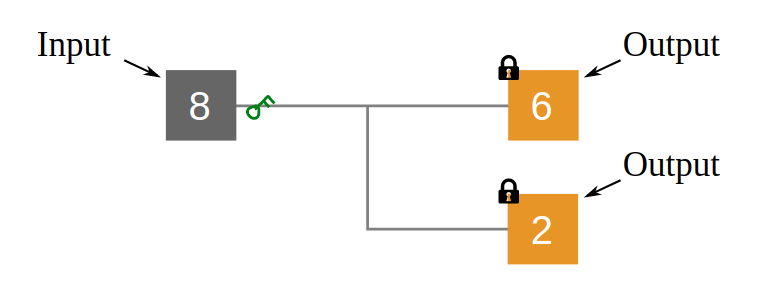<br>
* A bitcoin transaction is just a bunch of data that describes the movement of bitcoins.<br>
It takes in [inputs](#input), and creates new [outputs](#output).<br>

#### Structure<br>
* ⟲: Reverse Byte Order([Little-endian](https://learnmeabitcoin.com/guide/little-endian))<br>
* All of the data in a transaction is in [hexadecimal](https://learnmeabitcoin.com/guide/hexadecimal).<br>

| Field	| Data	| Size	| Description |
|-------|-------|-------|-------------|
| Version	| *01000000 ⟲*	| 4 bytes	| Which version of transaction data structure we’re using. |
| Input Count	| 01	| [Variable](#variable-ingeter)	| Indicates the upcoming number of inputs. |
| [Input-TXID](#txid)	| *0796…efc ⟲*	| 32 bytes	| Refer to an existing transaction. |
| [Input-VOUT](#vout)	| *001000000 ⟲*	| 4 bytes	| Select one of its outputs. |
| Input-ScriptSig Size | 6a	| [Variable](#variable-ingeter)	| Indicates the upcoming size of the unlocking code. |
| Input-ScriptSig	| 0473…825		| A script | that unlocks the input. |
| Input-Sequence	| *ffffffff ⟲*	| 4 bytes |  |
| Output Count	| 01	| [Variable](#variable-ingeter)	| Indicate the upcoming number of outputs. |
| Output-Value	| *4baf210000000000 ⟲*	| 8 bytes	| The value of the output in satoshis. |
| Output-ScriptPubKey Size	| 19	| [Variable](#variable-ingeter)	| Indicates the upcoming size of the locking code. |
| [Output-ScriptPubKey](#scriptpubkey)	| 76a9…88ac	| 	| A script that locks the output. |
| [Locktime](https://learnmeabitcoin.com/guide/locktime)	| *00000000 ⟲*	| 4 bytes	| Set a minimum block height or Unix time that this transaction can be included in. |

#### Diagram<br>
* A transaction is basically a series of [inputs](#input) and a series of [outputs](#output).<br>
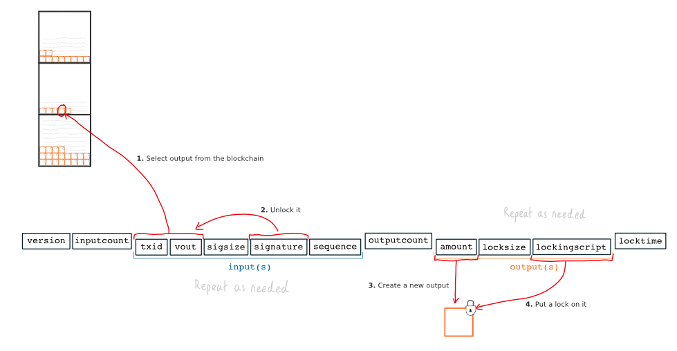<br>
* In further detail; the transaction data tells you how to unlock existing packages of bitcoins (from previous transactions), and how to lock them up again in to new packages.<br>

### [Output](https://learnmeabitcoin.com/guide/output)<br>
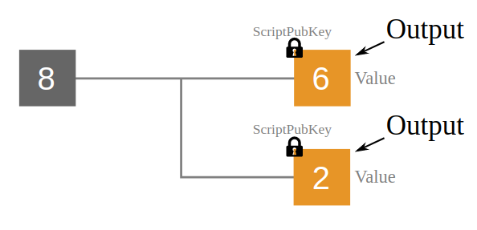
* Outputs are packages of bitcoins created in a bitcoin transaction.<br>
Each output has a lock, which means that they can only be used as an [inputs](#input) in a future transaction by people who can unlock them.<br>

#### Field<br>
| Field	| Data	| Size	| Description |
|-------|-------|-------|-------------|
| Value	| *4baf210000000000 ⟲*	| 8 bytes	| The value of the output in satoshis. |
| ScriptPubKey Size	| 19	| [Variable](#variable-ingeter)	| Indicates the upcoming size of the locking code. |
| [ScriptPubKey](#scriptpubkey)	| 76a9…88ac	| 	| A script that locks the output. |

### How do Outputs work?<br>
* After selecting Input(s) to spend, you can create as many Outputs from them as you like.<br>
For each output you just:<br>
    1. Value<br>
    2. Lock<br>

1. Value
* Every output has a value. This value is given in satoshis:<br>
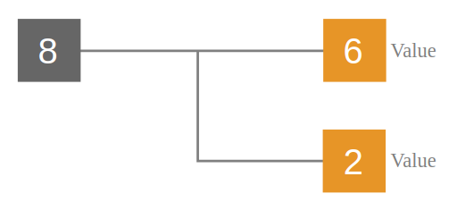
> You can create as many outputs as you like, as long as their sum **does not exceed the sum of the Inputs** you are spending.<br>

2. Lock
* You also place locks on outputs when you create them them. These locking scripts prevent other people from using these outputs as inputs in another transaction (i.e. spending them).<br>
This locking code is called a **ScriptPubKe**y.
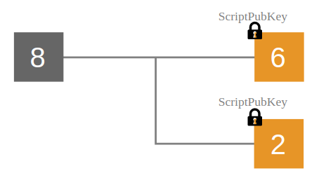
> You can only use an output as an input to another transaction if you can unlock it.<br>

### [Input](https://learnmeabitcoin.com/guide/input)<br>
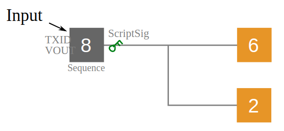
* An input is what you call an output when you’re spending it in a transaction.<br>

#### Field<br>
| Field	| Data	| Size	| Description |
|-------|-------|-------|-------------|
| [TXID](#txid)	| *0796…efc ⟲*	| 32 bytes	| Refer to an existing transaction. |
| [VOUT](#vout)	| *001000000 ⟲*	| 4 bytes	| Select one of its outputs. |
| ScriptSig Size | 6a	| [Variable](#variable-ingeter)	| Indicates the upcoming size of the unlocking code. |
| ScriptSig	| 0473…825		| A script | that unlocks the input. |
| Sequence	| *0ffffffff ⟲*	| 4 bytes |  |

* TXID Byte Order: When you refer to a **TXID** within transaction data, you have to **reverse the byte order** to get it in its original format. The byte-order used when searching for a TXID is in reverse (due to a historical mistake in the way the original bitcoin client works).<br>

#### How do Inputs work?<br>
1. Select an Output.
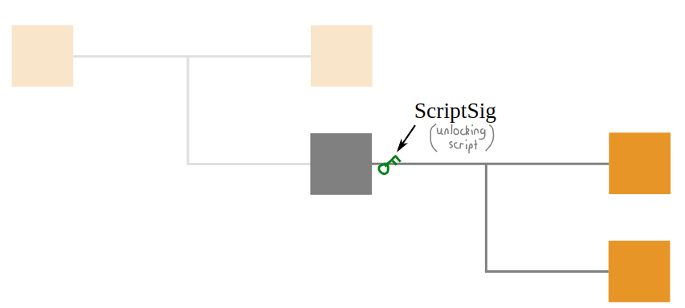
* When you want to use an output as an input for a transaction, you just need to specify which one you want to spend.<br>
Every transaction has a unique [TXID](#txid), so by using that with a specific output number ([VOUT](#vout)), you can refer to any output in the blockchain.<br>

2. Unlock it.

* After selecting an output, you then have to be able to unlock it.<br>
Each output is set with a locking script. So if you want to spend one, you need to supply an unlocking script (called a **ScriptSig**).<br>
> [Nodes](https://learnmeabitcoin.com/beginners/nodes) validate every transaction they receive. So if you do not provide an unlocking script that satisfies the locking script, your transaction will get rejected.

### [ScriptPubKey](https://learnmeabitcoin.com/guide/scriptPubKey)<br>

### [Script](https://learnmeabitcoin.com/guide/script)<br>

### [TXID](https://learnmeabitcoin.com/guide/txid)<br>
* A **TXID(Transaction ID)** is basically an identification number for a bitcoin transaction. A TXID is **always 32 bytes(64 characters)** and hexadecimal.<br>

#### Creating a TXID<br>
* You get a TXID by [hashing](https://learnmeabitcoin.com/guide/hash-function) transaction data through **SHA256 twice**.
* If you’ve just hashed some transaction data and want to search for a TXID in the blockchain, you have to search for it in reverse byte order.<br>

```Bash
txid (original):  169e1e83e930853391bc6f35f605c6754cfead57cf8387639d3b4096c54f18f4
txid (searching): f4184fc596403b9d638783cf57adfe4c75c605f6356fbc91338530e9831e9e16
```
> Due to historical accident, the tx and block hashes that bitcoin core uses are byte-reversed. I’m not entirely sure why. May be something like using openssl bignum to store hashes or something like that, then printing them as a number. – Wladimir van der Laan (Bitcoin Core developer)<br>

* In other words, this was a slight oversight in the early development of Bitcoin that has now become a standard.<br>

#### Where are TXIDs used?<br>
1. Searching the blockchain.<br>
* If you’ve just made a transaction, you can use the TXID to find it in the blockchain.<br>

2. Spending outputs.<br>
* You use a TXID when you want to use an existing output as an input in a new transaction.<br>
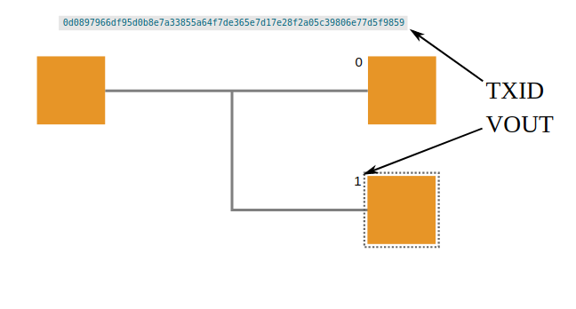<br>
> To refer to an existing output, you use the txid it was created in, along with the **vout** number for that transaction.<br>

### [VOUT](https://learnmeabitcoin.com/guide/vout)<br>
* A **vout** is basically an index number for an [output](#output) in a transaction.<br>

## [Address](https://learnmeabitcoin.com/guide/address)<br>
* An address is what you give to people so that they can “send” you bitcoins. When someone receives it, they can create **a specific locking script** based on the type of address you have given them.<br>

#### How do you create an address?<br>
1. Some specific data that you would like included in the lock. For example, your hash160(publickey).<br>
2. A prefix to indicate what kind of lock to create.<br>
3. And a checksum to help with catching any typos.<br>
* Finally, all of that gets converted to Base58, which makes it a little more user-friendly.<br>
  1. Pay To PubKey Hash (P2PKH)<br>
  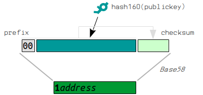
  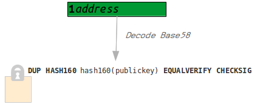
  2. Pay To PubKey Hash (P2SH)<br>
  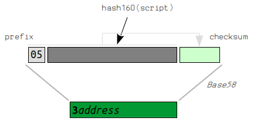
  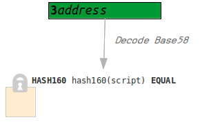

#### Prefixes<br>
* As mentioned, the prefix you use will indicate the type of locking script to create.<br>
Here are a list of common address prefixes:<br>

| Prefix | Locking Script | Leading Character | Example Address |
|--------|----------------|-------------------|-----------------|
| 00 | P2PKH | 1 | 1AKDDsfTh8uY4X3ppy1m7jw1fVMBSMkzjP |
| 05 | P2SH | 3 | 34nSkinWC9rDDJiUY438qQN1JHmGqBHGW7 |
| 6F | P2PKH (testnet) | m or n | ms2qxPw1Q2nTkm4eMHqe6mM7JAFqAwDhpB |
| C4 | P2SH (testnet) | 2 | 2MwSNRexxm3uhAKF696xq3ztdiqgMj36rJo |

> The prefix will also alter the leading character of an address, so you can tell what kind of locking script has been used by just looking at the address itself.<br>

#### Why do we use addresses?<br>
>  An address is a short-hand way of writing locking scripts in a human-readable way. - echeveria (on IRC)<br>

If we didn’t use addresses, we would have to send other people complete locking scripts, like this:
```Text
76a914662ad25db00e7bb38bc04831ae48b4b446d1269888ac # P2PKH script
```
But by using addresses, we can just send something like this instead:
```Text
1AKDDsfTh8uY4X3ppy1m7jw1fVMBSMkzjP
```
They both achieve the same result, but addresses give us a more user-friendly format to pass around. Not to mention the fact that they contain a checksum, which means that errors can be detected if someone writes an address incorrectly.<br>

#### Code<br>
```Ruby
def hash160_to_address(hash160, type=:p2pkh)
  prefixes = {
    p2pkh: '00',         # 1address - For standard bitcoin addresses
    p2sh:  '05',         # 3address - For sending to an address that requires multiple signatures (multisig)
    p2pkh_testnet: '6F', # (m/n)address
    p2sh_testnet:  'C4'  # 2address
  }

  prefix = prefixes[type]
  checksum = checksum(prefix + hash160)
  address = base58_encode(prefix + hash160 + checksum)

  return address
end

hash160 = '662ad25db00e7bb38bc04831ae48b4b446d12698'
puts hash160_to_address(hash160) # 1AKDDsfTh8uY4X3ppy1m7jw1fVMBSMkzjP
```

### [Script](https://learnmeabitcoin.com/guide/script)<br>
* Script is a mini programming language used as a locking mechanism for outputs.<br>
    * A locking script is placed on every output.<br>
    * An unlocking script must be provided to unlock an output (i.e. when you’re using it as an input).<br>
* If a full script (unlocking + locking) is valid, the output is “unlocked” and can be spent.<br>

#### What is the Script language?
* Script is a very basic programming language. It consists of two types of things:<br>
    * Data - For example; public keys and signatures.<br>
    * OPCODES - Simple functions that operate on the data.<br>
* Here’s a simple diagram of a typical P2PKH script used in Bitcoin:<br>

> Here’s a full list of [Opcodes](https://en.bitcoin.it/wiki/Script#Opcodes).<br>

#### How do you run Script?
> The complete script is run from left-to-right. As it runs, it makes use of a data structure called a “stack”.<br>
1. Data is always pushed on to the stack.<br>
2. OPCODES can pop elements off the stack, do something with them, then optionally “push” new elements on to the stack.<br>

#### What makes a Script valid?
* A script is valid if the top element left on the stack is a 1 (or greater).<br>
> The script is invalid if:<br>
1. The final stack is empty<br>
2. The top element is on the stack is 0<br>
3. The script exits prematurely (e.g. OP_RETURN in a NULL DATA script).<br>

### [SegWit](https://learnmeabitcoin.com/faq/segregated-witness)<br>
* Segregated Witness is a proposal to change the structure of bitcoin [transaction data](https://learnmeabitcoin.com/guide/transaction-data).<br>
* The main reason for doing this is to fix the problem of **transaction malleability**. However, this change also allows for other **benefits**, such as **increasing the number of transactions** that can fit in to a block.<br>

#### What are the changes?<br>
* In the current transaction data structure, signatures (the code that “unlocks” existing bitcoins) sit next to each input, so this unlocking code is spread throughout the transaction data. The TXID is then created from the entire transaction data.<br>

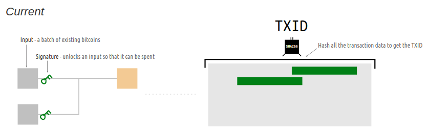<br>

* In Segregated Witness (occassionally and affectionately referred to as SegWit from here on out), the proposal is to move all of the unlocking code to the end of the transaction data. The TXID is then created from all of the transaction data, except for the **unlocking code**.<br>

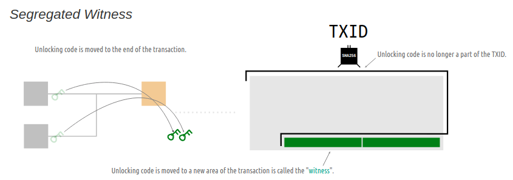<br>

#### Results<br>
* The TXID is only influenced by the effects of a transaction (the movement of bitcoins), and not by any code needed to validate the transaction (i.e. signatures used to unlock existing bitcoins so that they can be spent).<br>

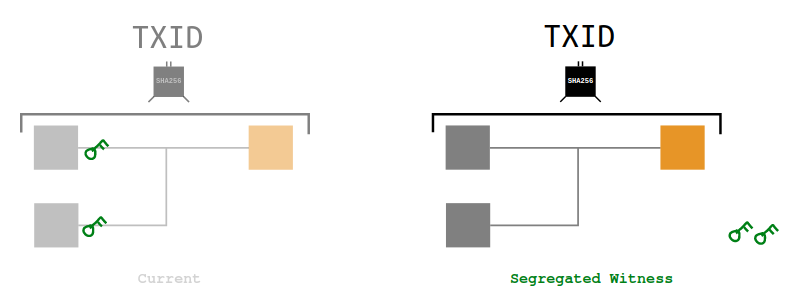<br>

* So in essence, you have separated the “validating” part (unlocking code) from the “effective” part of the transaction.<br>


#### What are the benefits?<br>
1. Fixes Transaction Malleability<br>
* In Bitcoin, Transaction Malleability refers to the fact that the TXID of a transaction can be changed by altering the unlocking code in the transaction.<br>

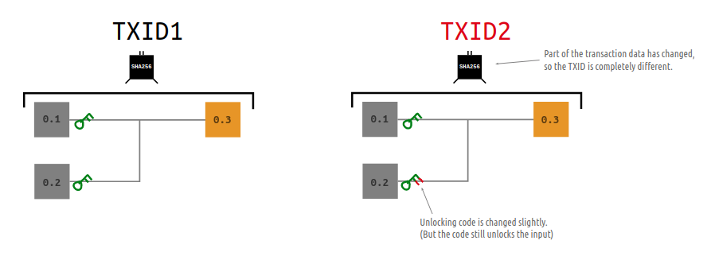<br>

* This means that when you send your transaction in to the network, any node has the ability to change the the TXID before passing it on.<br>

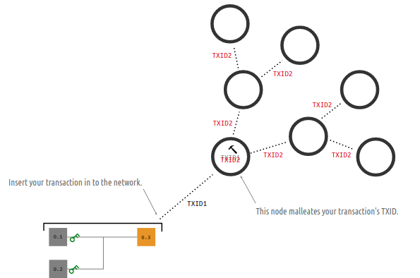<br>

* However, if the unlocking code is no longer part of the TXID, then no node will have the ability to change the TXID of your transaction.<br> 

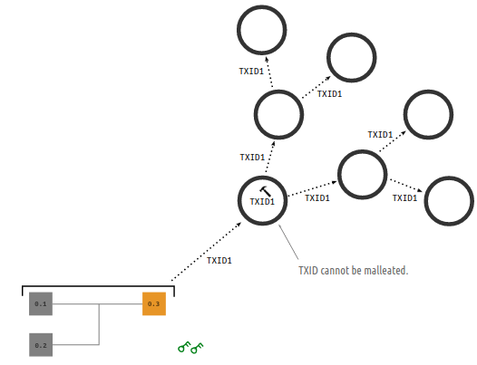<br>

> So in other words, Segregated Witness makes your TXIDs reliable.<br>

2. Increases Block Capacity<br>


## References
1. [Bitcoin Developer Reference](https://bitcoin.org/en/developer-reference)
2. [Learn me a Bitcoin](https://learnmeabitcoin.com/)
3. [blk.dat](https://learnmeabitcoin.com/guide/blkdat)
4. [VarInt](https://learnmeabitcoin.com/guide/varint)
5. [Magic Bytes](https://learnmeabitcoin.com/guide/magic-bytes)
6. [Block Header](https://learnmeabitcoin.com/guide/block-header)
