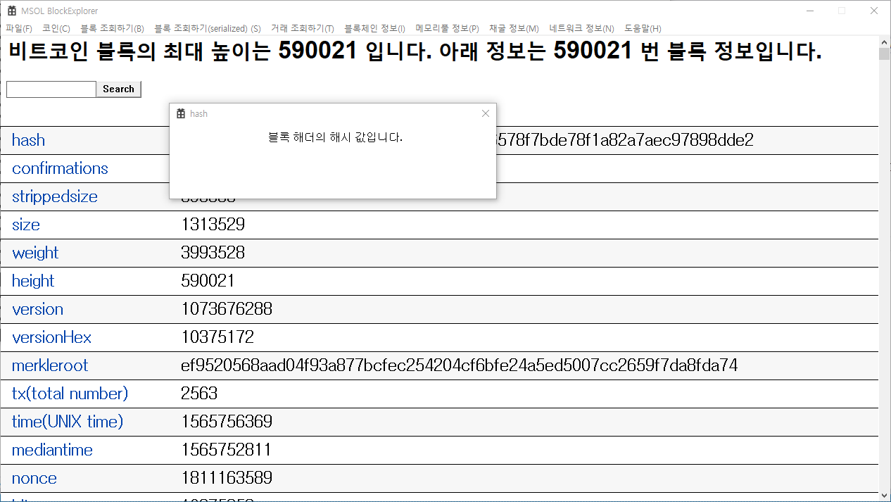

# WinAPI_BlockExplorer 

## Block Explorer WinAPI Ver. 
* Start date: May 14 2019 
* OS: Windows 10 
* IDE: Visual Studio 2015  
## Branches 
* **fix-UI: 블록 정보 출력 형태를 변경함(완료)** 
* prev_next_btn: 이전 또는 다음 버튼을 body 상단에 구현함 
* nonce_difficulty_formula: nonce와 difficulty 계산에 오류가 있어 개선 필요함 
* **popup_information: 블록의 자료구조 항목명을 클릭하면 그에 해당하는 설명을 팝업 형태로 띄움(완료)** 
* **show_txs_detail: 거래 정보들을 자세하게 출력(진행중)** 
* show_address_info: 주소 정보들을 자세하게 출력(총 잔액이 얼마고, 언제 거래를 하고, 언제 출금 및 입금이 되는가)  
## 구현 Roadmap 
  * **cURL 기능 추가(May 21 2019, 완료)** 
  * **콘솔 환경 작업을 WinAPI 환경에 porting(May 23 2019, 완료)** 
  * **기본 함수들 구현 - getblock, getblockhash, getbestblockhash, ...(May 28 2019, 완료)** 
  * **getblock 결과 parsing(June 4 2019, 완료)** 
  * **UI 디자인 시작(August 1 2019, 완료)** 
  * **getblock 결과 serialized로 받기(June 20 2019, 완료)** 
  * **스크롤 기능 개선(https://ospace.tistory.com/68 참고)(August 1 2019, 완료)** 
  * ~~블록 정보 조회 시 상단에 Serialized 정보 같이 표시~~ TX의 개수에 따라 Serialized 정보가 매우 많아지므로, 선택에 따라 표시하도록 수정 
  * **스크롤 위치에 따른 hEdit, hBtn 위치 연동(August 1 2019, 완료)** 
  * **char -> TCHAR 변환할 것(August 1 2019, 완료)** 
  * *용어 정리(June 19 2019, 진행 중)* 
  * *Version에 따른 블록 내부 구조 자료 정리할 것(June 26 2019, 진행 중)* 
  * *Block 생성 과정(소스코드) 정리할 것(July 8 2019, 진행 중)* 
  * Mempool에 거래들이 어떻게 저장되어 있는가? 
  * Mempool 저장 시 검증 알고리즘은 무엇인가? 
  * Mempool이 꽉 차면 어떠한 조치가 이루어지는가? 
  * 다른 기능들도 화면에 일단 뿌려줄 것 
  * UTXO 관리 방법(또는 어떻게 관리하는지), 지갑과의 관계 
  * UTXO은 어떻게 조회하는가? 
  * UTXO는 어디에 저장되어 있는가? 
  * 51% 공격 시뮬레이션 
  * Confirmation 이루어지는 과정(만약 내가 고의로 confirmation을 거절할 경우 어떻게 되는가?) 
  * 내가 만약 채굴자라면, 블록 내 TX 는 어떻게 선택하는가? 
  * 거래 추적 기능 
  * 주소 별 거래 정보 저장 DB 구축 
  * 계좌 별 비트코인 잔액 
  * 비트코인 보유량 rank 
  * levelDB 파일 자료구조 분석  
## 참고 
https://btc.com/ 
btc.com 사이트에서 네트워크 상태 표시 참고하여 UI 구성 
http://egloos.zum.com/dialup/v/2154456 
https://m.blog.naver.com/aepkoreanet/221151260644 
https://m.blog.naver.com/PostView.nhn?blogId=aepkoreanet&logNo=221168161570&proxyReferer=https%3A%2F%2Fwww.google.com%2F 
https://ihpark92.tistory.com/6?category=746286 
https://steemit.com/blockchain/@niipoong/utxo-bitcoin-trading-and-utxo 
https://steemit.com/kr/@niipoong/scriptsig-scriptpubkey 
