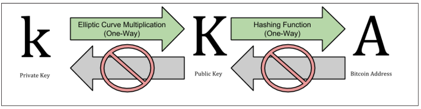
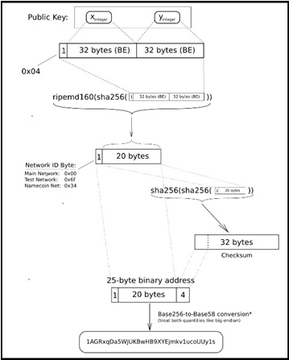

# 비트코인 시스템에서 사용하는 암호 기술 

비트코인은 디지털 서명 암호기술로, 공개키 암호기술 구현 방식의 한 종류인, ECC(Elliptic Curve Cryptography : 타원곡선 암호기술) 방식을 사용합니다. 기존 공개키 암호 알고리즘인 RSA 방식에서 사용하는 소수(prime number)를 사용하지 않고, 타원곡선(elliptic curve)을 사용하는 알고리즘입니다. 타원곡선 방식이 CPU나 memory 와 같은 컴퓨팅 자원을 덜 사용하기 때문이라고 합니다.  

요약하면, 비트코인 시스템은 비트코인 거래(transaction)를 인증(진짜인 것을 증명)하기 위하여 ECDSA 암호 알고리즘을 사용하고 있습니다. 따라서 비트코인 시스템의 Security 는 ECDSA 암호 알고리즘의 Security 에 의해 결정되어 집니다. 그리고 ECDSA 암호 알고리즘의 Security 는 사용되는 개인키(Private-Key)의 Security에 의해 결정되어 집니다.  

## ECDSA 와 secp256k1 

ECDSA(Elliptic Curve Digital Signature Algorithm)는 ECC(Elliptic Curve Cryptography) 방식에 속하는 디지털 서명 용도로 사용되는 암호 알고리즘입니다. ECC는 RSA암호방식에 대한 대안으로 1985년도에 제안된 방식입니다. 암호키의 길이가 길면 보안은 강화 되지만, 암호연산 속도가 감소됩니다. 따라서 보안을 강화하기 위해 RSA방식의 암호키 길이를 늘리는 대신에 ECC 방식을 사용하는 추세에 있습니다.  

ECDSA는 비트코인 소유주를 증명하고, 비트코인 거래를 인증하는 용도로 사용되고 있습니다. 비트코인 거래(transaction)가 “비트코인 소유자(비트코인(bitcoin)이 assign된 “비트코인 주소”를 소유하고 있는 자)”에 의해 생성된 것임을 증명하기 위하여 서명값(Signature : 소유자의 ECDSA Private-Key로 해당 transaction을 디지털 서명한 값)과 소유자의 ESDSA Public-Key가 transaction 정보에 들어 있습니다. 따라서 transaction을 받은 자는, transaction을 생성한 자의 Public-Key를 가지고 디지털 서명을 검증하여 해당 transaction이 진짜인지를 확인합니다.  

비트코인 시스템은 ECDSA의 parameter로 secp256k1 curve를 사용합니다. secp256k1 curve는 표준으로 제정되어 있으며, elliptic curve를 만들기 위한 상수 집합 입니다. 이것을 “Elliptic curve 256-bit domain parameter” 라고 부릅니다.  

Domain parameter T 는 (p,a,b,G,n,h)로 표시하며, 값은 아래와 같이 정의 되어 있습니다. 

<pre><code>
T = (p,a,b,G,n,h)
p :  FFFFFFFF FFFFFFFF FFFFFFFF FFFFFFFF FFFFFFFF FFFFFFFF FFFFFFFF FFFFFC2F
a :  00000000 00000000 00000000 00000000 00000000 00000000 00000000 00000000
b :  00000000 00000000 00000000 00000000 00000000 00000000 00000000 00000007
G :  02 79BE667E F9DCBBAC 55A06295 CE870B07 029BFCDB 2DCE28D9 59F2815B 16F81798
n :  FFFFFFFF FFFFFFFF FFFFFFFF FFFFFFFE BAAEDCE6 AF48A03B BFD25E8C D0364141
h  : 01
</code></pre>
  

## SHA-256 과 RIPEMD-160 

SHA-256 과 RIPEMD-160은 비트코인에서 사용되고 있는 해쉬(Hash) 알고리즘 입니다. RIPEMD는 RACE Integrity Primitives Evaluation Message Digest 의 약어 입니다.  

해쉬(Hash) 알고리즘은 전달되는 메세지가 전달 도중에 변조 되지 않았음을 증명하기 위해 사용되는 암호 기술입니다. 원본 메시지를 “해쉬 함수”에 넣어 “해쉬값”을 산출하는 데(이 과정을 해슁한다고 합니다), “해쉬값”과 “해쉬 함수”를 안다고 하더라도, 원본 메시지를 유추해 낼 수 없는 특징을 가지고 있습니다.  

비트코인 시스템에서 해쉬 알고리즘이 사용되는 곳은 아래와 같습니다.
1. 비트코인 주소(Bitcoin Address) 생성
2. 거래(transaction) 생성시 디지털 서명
3. 블록 생성 : 블록 헤더에는 연결된 이전 블록 헤더의 해쉬값(SHA-256의 결과 값인 32-Byte)이 저장 됩니다.  

RIPEMD-160 은 오리지날 RIPEMD 버전(128-bit 버전)에서 기능이 향상된 160-bit 버전을 의미 합니다. RIPEMD-160 의 output 길이는 160-bit 즉,  20 byte, Hexa로 40 digit 입니다. "비트코인 주소”를 생성할 때, SHA-256 과 RIPEMD-160 해쉬 알고리즘을 함께 사용합니다.  

## 비트코인 지갑(Bitcoin Wallet) 

 

비트코인 시스템을 사용하는 사용자는 “비트코인 지갑(Bitcoin Wallet)”을 가지고 있어야 합니다. “비트코인 지갑”은 “비트코인 주소”에 대응되는 Private-Key(개인키)를 보관하고 있는 장소 입니다. 한 개 이상의 Private-Key를 보관할 수 있습니다. Private-Key에서 Public-Key를 생성할 수 있고, Public-Key에서 “비트코인 주소”를 만들 수 있기 때문에, “비트코인 지갑”을 Private-Key 와 Public-Key 쌍을 보관하고 있는 장소라고 하기도 하며, Private-Key 와 “비트코인 주소”를 함께 보관하고 있는 장소라고 하기도 합니다. 개념적으로 설명하면, “비트코인 지갑”이란 비트코인(bitcoin) 거래(transaction)에 필요한 정보를 보관하고 있는 장소입니다.  

“비트코인 지갑”은 Private-Key가 보관되는 장소에 따라, 개인지갑(Private-Wallet), 웹지갑(Web-Wallet), 종이지갑(Paper-Wallet) 으로 구분합니다.
* 개인지갑(Private-Wallet) :  “비트코인 지갑 기능”을 하는 Application을 자신의 PC에 설치하여 만드는 것입니다. 당연히 Private-Key는 개인 PC의 하드디스크 나 USB장치에 암호화된 상태로 보관되어 집니다. Private-Key의 보호는 전적으로 개인의 책임하에 이루어지게 됩니다. 개인지갑을 Software Wallet이라고도 부릅니다. 개인지갑을 만들 때는 개인 정보는 요구되지 않습니다.
* 웹지갑(Web-Wallet) : 온라인상의 웹(Web) 서버에서 만들어지는 지갑입니다(이러한 온라인 서비스를 제공하는 회사가 있습니다). 웹지갑을 만들 때 실명을 요구하지 않습니다.
* 종이지갑(Paper-Wallet) : Private-Key를 종이(Paper) 에 인쇄해 두는 것입니다. 따라서 종이 지갑은 Private-Key가 바로 보여지기 때문에 
금고 같은 곳에 안전하게 보관해야 합니다. 종이지갑은 Online 상에서 사용되는 것이 아니라 Offline 상에서 사용되는 것입니다.  

“비트코인 거래소”는 “웹지갑 기능”과 “환전 기능”을 함께 제공해 주는 회사이며, "환전 기능"을 이용하기 위해선 자신의 개인 정보를 거래소에 제공해야 합니다. 거래소를 사용한다는 뜻은 거래소에 자신의 계정을 생성하고, 그 계정 내에 지갑을 만드는 것입니다. 한 개인이 개인 지갑과 거래소 지갑을 각각 가지고 있는 경우도 가능합니다. 즉 환전이 필요할 경우에만 “거래소 지갑”에 있는 “비트코인 주소”로 송금한 후, 거래소에서 환전을 하면 됩니다.  

“지갑 소프트웨어”는 타원곡선(elliptic curve)을 사용하는 공개키 암호 알고리즘(public-key cryptography)을 사용하여, 
개인키(Private-Key)와 공개키(Public-Key)를 생성합니다.
개인키(Private-Key)는 자신의 비트코인에 접근하거나, 지불할 때, 인증 용도로 사용되어지므로 안전하게 보관해야 합니다. 
거래소에 지갑을 생성한 경우에는 거래소가 자신의 개인키(Private-Key)를 안전하게 보관해 주는 서비스를 제공하지만, 
지갑에 접근할 수 있는 권한(본인임을 인증하는 수단 : 비밀번호 등)이 유출되면 타인이 자신의 지갑을 사용하게 되는 위험성은 여전히 존재합니다. 
공개키(Public-Key)는 비트코인 주소를 생성하는 용도로도 사용됩니다.  

## 비트코인 거래(Bitcoin Transaction) 

거래(transaction)를 하려면, “비트코인 지갑(지갑 기능을 하는 SW)”에서 “송금자가 사용할 비트코인 주소”를 선택하고(지갑에 여러 개의 주소가 있을 수 있으므로), “수신자 비트코인 주소”와 “bitcoin 금액”을 입력하면 됩니다. 비트코인 거래(transaction)란, “송신자의 비트코인 주소”에서 “수신자의 비트코인 주소”로 “비트코인(bitcoin) 소유권”이 이전되는 것입니다. 소유권 이전이 정당하게 이루어 졌다는 것을 보증하기 위하여 송신자의 디지털 서명이 들어 있는 것입니다. 그리고 거래 장부는 소유권을 넘긴 기록이 보관되어 잇는 곳이라고 볼 수 있습니다. 그리고 하나의 거래에는 이전 거래 내역이 모두 연결되어 있습니다.  

## 비트코인 주소(Bitcoin Address) 

비트코인 주소는 공개키(Public-Key 값을 가지고 해쉬(Hash) 함수를 사용하여 만든 값이라고 간단히 이야기 합니다만, 아래 설명처럼 여러 단계의 변환 과정을 거쳐서 만들어 집니다.  

### ECDSA Public-Key 값에서 비트코인 주소가 만들어 지는 과정 
0. ECDSA(parameter로 secp256k1 curve 사용) 의 Private-Key 는 256-bit 길이 즉 32-byte 크기이며, Public-Key는 64-byte 크기 입니다. X축 32-byte 와 Y축 32-Byte로 구성되어 있습니다. 

1. 0x04 값을 Public-Key 앞에 삽입하여 65-Byte 값을 만듭니다.
2. 위에서 만들어진 65-Byte 를  SHA-256 해쉬 함수로 해싱(Hashing: 해쉬 함수로 계산)합니다. 결과 값은 32-byte 가 됩니다.
3. 위에서 만들어진 32-Byte 를 RIPEMD-160 해쉬 함수로 해싱합니다. 결과 값은 20-Byte(160-bit)가 됩니다.
4. 위에서 만들어진 20-Byte 앞에 1-Byte Network ID 값을 앞에 삽입니다.
* 0x00 : Main Network
* 0x6d : Test Network
* 0x34 : Namecoin Network
5. 위에서 만들어진 21-Byte 를  SHA-256 해쉬 함수로 해싱합니다. 결과 값은 32-byte 가 됩니다.
6. 위에서 만들어진 32-Byte 를  한번 더 SHA-256 해쉬 함수로 해싱합니다. 결과 값은 32-byte 가 됩니다.
7. 위에서 만들어진 32-Byte 중 첫 4-Byte를 Address checksum 값이라고 합니다.
8. 위에서 만들어진 4-Byte 값을, 4번에서 만들어진 21-Byte 값 뒤에 붙여, 25-Byte 값을 만듭니다.
9. 위에서 만들어진 25-Byte 값을 Base58Check encoding 기법을 사용하여 base58 문자열로 변환 시킵니다(잘못 인식될 수 있는 대문자 O 와 숫자 10, 대문자 I(아이) 와 소문자 l(엘)은 버림). 결과값은 25-byte 에서 34-Byte 크기의 문자열이 됩니다(길이가 변하는 이유는 0 와 O 같은 문자는 자동으로 빠지게 되기 때문입니다). 대부분의 주소는 33-byte 또는 34-Byte 크기라고 합니다. 첫 번째 문자는 1 입니다(Public-Key로 만든 주소는 첫 번째 문자가 1 이지만, Script를 가지고 만든 주소는 첫 번째 문자가 3 입니다.  Script는 간단히 말해, multiple Private-key가 요구되는 Multi-signature address라고 합니다). 

Example : 1AGRxqDa5WjUKBwHB9XYEjmkv1ucoUUy1s 

아래 그림은 만들어지는 과정을 도식화 한 것입니다.  

  

비트코인 주소의 특징은 아래와 같습니다. 

1. 내부적으로 checksum code를 가지고 있기 때문에, 실수로 mistype 하더라도 걸러지게 됩니다(mistype한 주소가 다른 사람의 실제 주소일 확률은 “42억9천만 분의 1” 이라고 합니다).
2. 비트코인 지갑(지갑속에 있는 Private-Key)을 분실한 주소로 비트코인(bitcoin)을 보내게 되면, 영원히 사라지게 됩니다.
3. 독립된 두 지갑의 주소가 일치할 확률(암호분야에서는 이것을 collision 이라고 부름)은 거의 없다고 합니다.
4. 비트코인 주소의 용도는 Payment를 받을 때 사용하는 것이며, Payment를 보낼 때는 사용하지 않습니다. 즉 “From address” 는 비트코인 거래(transaction)에서 사용하지 않습니다. 사전에 “누군가”에게 “이 주소로 보내라” 라고 서로 약속을 하기 때문에 송금한 자를 알 수 있는 것입니다. 거래(transaction) 내역만을 보고는 알 수 없습니다.
5. 비트코인 주소에 대응되는 Private-Key를 가지고 있는 자만이 그 “비트코인 주소”가 가지고 있는 비트코인(bitcoin)으로 새로운 거래를 수행 할 수 있습니다.
6. 비트코인 주소의 소유주는 알 수 없습니다. 거래(transaction) 내역은 분산 장부에 기록되어 지며, 비트코인 Network에 접속 할 수 있는 자는 누구나 “거래 내역”을 볼 수 있지만(blockchain.info 와 같은 block chain explorer를 사용함), 거래 내역에 기록된 비트코인 주소의 소유주는 알 수 없습니다.
7. 비트코인 주소는 재사용(re-use)하지 않는 것이 좋다고 합니다. 재사용 할 경우, Privacy 와 Security 에 매우 나쁘다고 합니다. 한 개의 주소만 가질 수 있는 종이지갑(Paper-Wallet)은 일회용 선물이나 Gift 용도로 사용 할 수 있다고 합니다. 종이지갑을 받은 자는 종이지갑에 들어 있는(실제로는 종이에 Private-Key가 인쇄되어 있습니다) Private-Key를 자신의 “비트코인 지갑”에 import 시킨 후 파기하는 것이 좋다고 합니다. 아니면 나중에 사용할 때까지 금고에 안전하게 보관해야 한다고 합니다. 

비트코인 사용자는 한 개 이상의 비트코인 주소를 생성할 수 있으며, 거래할 때마다 새로운 비트코인 주소를 생성하여 사용할 수도 있습니다. 사용하고 있는 비트코인 주소가 많으면, 그만큼 비트코인 지갑에서 관리해야 하는 Private-Key도 많아지게 됩니다.  

비트코인 주소를 알면, 그 주소로 들어 온, 거래(Transaction)의 output인 비트코인(bitcoin) 금액을 알 수 있습니다. 즉 비트코인 주소에 거래(transaction)의 output인 bitcoin(BTC)이 assign 됩니다. 하나의 주소에 한 거래가 assign 되기도 하고, 하나의 주소에 여러개의  거래가 assign 되기도 합니다. 비트코인 주소에 assign된 bitcoin(BTC)은, 그 주소에 대응되는 Private-Key를 소유한 자 만이,  “다른 비트코인 주소”로 보낼 수 있습니다. 이것을 거래(transaction) 라고 부릅니다. Dollar와 같은 일반 화폐로 바꾸는 환전도 하나의 거래를 통해 이루어 집니다.   

## 난수 생성기(Random Number Generator) 의 중요성 

이론적으로 비트코인 거래를 가로채기 하려면, Private-Key를 예측하여 만든 후, 이 Private-Key를 가지고 비트코인 주소를 만들어 놓고(정확히 서술하면, Private-Key를 가지고 Public-Key를 생성하고, Public-Key로 비트코인 주소를 만듭니다), 비트코인 네트워크를 모니터링 하다가, 비트코인 주소가 동일한 거래(transaction)를 발견하면, Private-Key로 디지털 서명을 하여, 자신만이 알고있는 새로운 비트코인 주소로 보내면 됩니다. 따라서 이러한 가로채기를 방지하려면, Private-Key를 예측할 수 없도록 Random하게 생성해야 합니다. 즉 예측할 수 없는 Random Number를 가지고 Private-Key를 생성해야 합니다.  

이와 같은 특징으로, Random Number Generator가 그 핵심 기능을 하고 있습니다.
