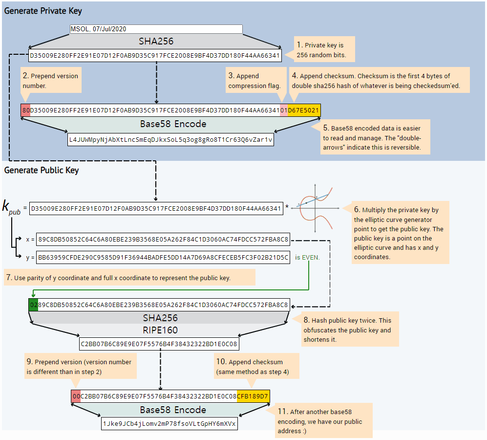

## Wallet<br>
### Private and Public Keys<br>
>   A bitcoin wallet contains a collection of key pairs, each consisting of a private key and a public key. The private key (k) is a number, **usually picked at random**. From the private key, we use **elliptic curve multiplication**, a **one-way cryptographic function**, to generate a public key (K). From the public key (K), we use a one-way cryptographic hash function to generate a bitcoin address (A).<br>
<br>

### Private Keys<br>
>   A private key is simply a number, picked at random. Ownership and control over the private key is the root of user control over all funds associated with the corresponding bitcoin address. The private key is used to create signatures that are required to spend bitcoin by proving ownership of funds used in a transaction.<br>
>   The following is a randomly generated private key (k) shown in hexadecimal format (256 bits shown as 64 hexadecimal digits, each 4 bits)<br>
```Text
1E99423A4ED27608A15A2616A2B0E9E52CED330AC530EDCC32C8FFC6A526AEDD
```

### Public Keys<br>
>   The public key is calculated from the private key using elliptic curve multiplication, which is irreversible: **K = k * G**, where k is the private key, G is a constant point called the generator point, and K is the resulting public key. <br>
<br>

### Bitcoin Addresses<br>
>   A bitcoin address is a string of digits and characters that can be shared with anyone who wants to send you money. Addresses produced from public keys consist of a string of numbers and letters, **beginning with the digit "1".**  Here’s an example of a bitcoin address:<br>
```Text
1J7mdg5rbQyUHENYdx39WVWK7fsLpEoXZy
```
>   The bitcoin address is derived from the public key through the use of one-way cryptographic hashing. A “hashing algorithm” or simply “hash algorithm” is a one-way function that produces a fingerprint or “hash” of an arbitrary-sized input. <br>
>   Cryptographic hash functions are used extensively in bitcoin: in bitcoin addresses, in script addresses, and in the mining Proof-of-Work algorithm. The algorithms used to make a bitcoin address from a public key are the Secure Hash Algorithm (SHA) and the RACE Integrity Primitives Evaluation Message Digest (RIPEMD), specifically SHA256 and RIPEMD160.<br>
<br>

### Base58 and Base58Check Encoding<br>
>   In order to represent long numbers in a compact way, using fewer symbols, many computer systems use mixed-alphanumeric representations with a base (or radix) higher than 10.<br>
>   Base58 is Base64 without the 0 (number zero), O (capital o), l (lower L), I (capital i), and the symbols “+” and “/”. Or, more simply, it is a set of lowercase and capital letters and numbers without the four (0, O, l, I) just mentioned.<br>
```Text
123456789ABCDEFGHJKLMNPQRSTUVWXYZabcdefghijkmnopqrstuvwxyz
```
<br>

### [Graphical Address Generator](http://royalforkblog.github.io/2014/08/11/graphical-address-generator/)<br>
<br>
